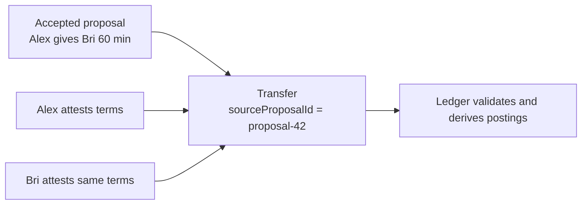

# Lesson 29: What Is a Transfer?

A transfer is the jointly confirmed statement that an agreed amount of time was delivered. It references one accepted proposal and carries the same participants, community, and minutes.



## What you already know

This is closer to both people signing a receipt than one person calling a server endpoint that immediately changes a balance.

```json
{
  "id": "transfer-42",
  "sourceProposalId": "proposal-42",
  "providerMemberId": "alex",
  "recipientMemberId": "bri",
  "minutes": 60,
  "providerAttestation": { "keyId": "alex-laptop", "signature": "…" },
  "recipientAttestation": { "keyId": "bri-phone", "signature": "…" }
}
```

## One small example

```ts
const check = validateSettlementTransfer(transfer, acceptedProposal);
if (check.ok) ledger.apply(transfer);
```

**Expected observation:** changing even one participant, the minute amount, community, or source proposal causes validation to reject the transfer. A record with one participant’s attestation is not settled.

## Peer Hours connection

`@peer-hours/timebank-settlement` validates the proposal-to-transfer match. `@peer-hours/timebank-ledger` verifies both participant attestations and applies a valid transfer once. These are working pure rules; transport and desktop composition remain to be built.

## Takeaway

A transfer is not an instruction from a node. It is a two-person agreement that the local ledger can independently validate.

## Next lesson

Continue with [Lesson 30: Why balance is derived instead of stored](30-derived-balance.md).
