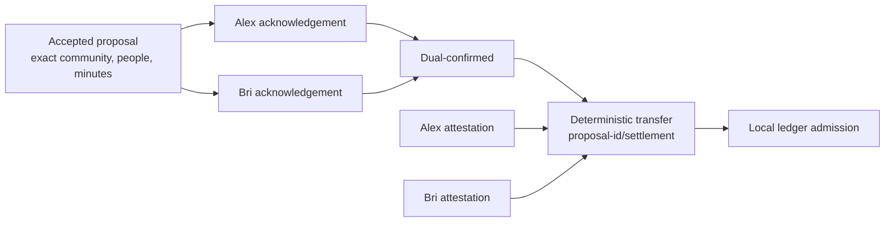

# Lesson 29: What Is a Settlement Transfer?

A normal settlement transfer is the jointly attested, deterministic record that an accepted exchange was completed. It is downstream of the proposal; it is not an arbitrary “change balance” command.



## Two related kinds of proof

An acknowledgement says a participant confirms completion of the accepted proposal’s exact terms. One acknowledgement produces the state `awaiting-counterparty`; both produce `dual-confirmed`. This is necessary before composing a normal transfer, but acknowledgements are not themselves ledger postings.

The transfer then carries two Ed25519 attestations over its canonical terms. Its ID is derived as:

```text
${proposalId}/settlement
```

This gives independent publishers one normal transfer identity instead of competing transfer IDs for the same accepted proposal.

```ts
const transfer = createDualConfirmedSettlementTransfer({
  proposal: acceptedProposal,
  acknowledgements: [alexAcknowledgement, briAcknowledgement],
  attestations: [alexSignature, briSignature],
});
```

**Expected observation:** composing with one acknowledgement fails. Changing the community, participant, minutes, proposal ID, deterministic transfer ID, or either signature’s signed bytes fails validation.

## Important boundary: admitted is not final

The settlement package can prove that a transfer is structurally tied to a dual-confirmed proposal and has authorized attestations. The ledger can admit it under its rules. Neither result proves durable replication to a chosen set of peers, network consensus, or irreversible finality.

## Takeaway

A settlement transfer is a specific, dual-confirmed and dual-attested statement of completion—not a command issued by a community node.

## Next lesson

Continue with [Lesson 30: Why balance is derived instead of stored](30-derived-balance.md).
