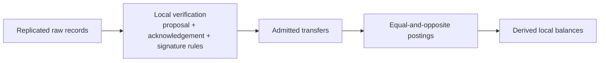

# Lesson 30: Why Balance Is Derived Instead of Stored

Peer Hours treats a balance as a local conclusion from verified, ledger-admitted transfers—not as a mutable number owned by a server.



## One small example

```ts
const ledger = applyTransfers({
  communityId,
  transfers: [verifiedSettlement],
  verifyAttestation,
});

// provider: +60; recipient: -60
console.log(ledger.balances);
```

**Expected observation:** replaying the same deterministic settlement does not create another posting. A transfer rejected for missing acknowledgements, bad signatures, mismatched proposal terms, duplication, or the credit rule changes no balance.

## Determinism is part of safety

The ledger evaluates valid transfers in stable transfer-ID order, including the current ordinary-transfer credit boundary. This avoids one device accepting a history merely because it happened to receive records in another order. The supporting transfer records remain inspectable, so a balance view can explain its inputs instead of asking members to trust an opaque total.

## Local view, not universal truth

Two devices with the same verified transfer history derive the same balance. A device that has not yet replicated a record may show an older local view. Therefore UI language should say “locally resolved” or “locally ledger-admitted,” not “globally final.”

## Takeaway

The evidence is authoritative for local calculation; the balance is a reproducible summary of that evidence.

## Next lesson

Continue with [Lesson 31: How one transfer changes two balances](31-two-balances.md).
