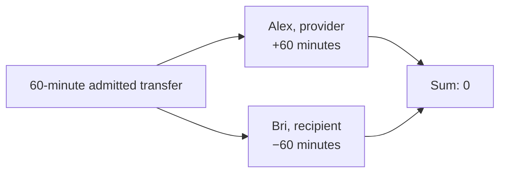

# Lesson 31: How One Transfer Changes Two Balances

Every locally admitted normal time transfer creates two equal-and-opposite postings. The provider earns time; the recipient spends the same amount. No time is minted by the exchange.



## One small example

```ts
const postings = postingsFor({
  providerMemberId: "alex",
  recipientMemberId: "bri",
  minutes: 60,
});
// [{ memberId: "alex", minutes: 60 }, { memberId: "bri", minutes: -60 }]
```

**Expected observation:** the postings sum to zero. A one-sided acknowledgement, a dual-confirmed state without a valid transfer, or a transfer rejected by the ledger produces no postings at all.

## Why the distinction matters

The workflow has several meaningful milestones:

| Milestone | Changes balance? |
| --- | --- |
| Pending proposal | No |
| Accepted proposal | No |
| One acknowledgement | No |
| Dual-confirmed acknowledgements | No |
| Locally admitted transfer | Yes, two postings |

This keeps completion evidence distinct from accounting evidence. A later correction is a separate valid reversal transfer; it does not rewrite the original immutable record.

## Takeaway

One admitted exchange moves equal time in opposite directions. The zero-sum invariant makes local accounting auditable.

## Next lesson

Continue with [Lesson 32: What is a key pair?](32-key-pairs.md).
