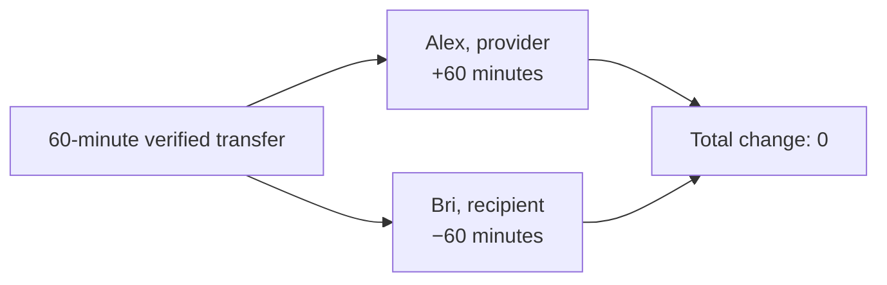

# Lesson 31: How One Transfer Changes Two Balances

Every valid time transfer creates two equal-and-opposite postings. The person who provides time gains hours; the person who receives time spends hours. The community total stays at zero.



## What you already know

Double-entry accounting is a useful comparison: instead of minting money, one event affects at least two sides so the totals can be checked.

```ts
const postings = postingsFor({
  providerMemberId: "alex",
  recipientMemberId: "bri",
  minutes: 60,
});

// [{ memberId: "alex", minutes: 60 }, { memberId: "bri", minutes: -60 }]
```

**Expected observation:** the postings sum to `0`. If a resolver sees only one half, it has a broken record model and must not claim the exchange settled.

## Peer Hours connection

The ledger package derives these postings only after the transfer passes its community, participant, attestation, proposal-linkage, idempotency, and credit-boundary rules. Corrections are separate dual-attested reversal transfers; they do not edit the old event.

## Takeaway

One exchange changes two members’ balances by the same amount in opposite directions. That invariant makes the shared accounting easier to inspect and verify.

## Next lesson

Continue with [Lesson 32: What is a key pair?](32-key-pairs.md).
