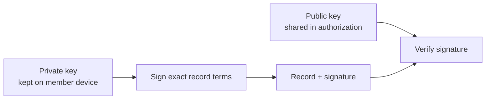

# Lesson 32: What Is a Key Pair?

A key pair is two mathematically related values: a private key kept by its owner and a public key shared with verifiers. The private key creates a signature; the public key checks it.



## What you already know

Passwords prove knowledge to one service. A signature lets many peers verify that a holder of a private key approved the same bytes, without receiving that private key.

```ts
const signature = sign(privateKey, canonicalTransferBytes);
const valid = verify(publicKey, canonicalTransferBytes, signature);
```

**Expected observation:** `valid` is true only when the signature, public key, and exact bytes match.

## Peer Hours connection

Peer Hours currently uses Ed25519 signing keys for member-key authorizations and transfer attestations. A root identity also signs the declaration that binds a member identity to a member feed. These roles are related but should not be blurred into one all-purpose secret.

## Takeaway

The private half proves approval. The public half lets anybody verify that proof.

## Next lesson

Continue with [Lesson 33: What public keys are safe to share](33-public-keys.md).
