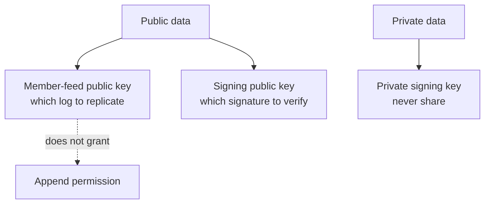

# Lesson 33: What Public Keys Are Safe to Share?

Public keys are intended to be copied into records, announcements, invitations, and verification rules. Sharing one lets another peer identify a feed or verify a signature; it does not let that peer sign or append as the owner.



## One small example

```text
Safe to place in a signed declaration:
  feedPublicKey: "a4c1…"
  signingPublicKey: "base64url…"

Never place there:
  privateKey: "…"
```

**Expected observation:** another runtime can open the named feed as a reader and verify a signature, but it cannot create a valid new block or signature as its owner.

## Peer Hours connection

The bootstrap manifest includes a public discovery-core key. A member-feed declaration includes a public feed key. Authorization events include public Ed25519 keys. All are shareable identifiers or verification material, not credentials.

## Takeaway

“Public” does not mean unimportant. It means safe to distribute so compatible peers can find or verify the right thing.

## Next lesson

Continue with [Lesson 34: What private keys must never leave](34-private-keys.md).
