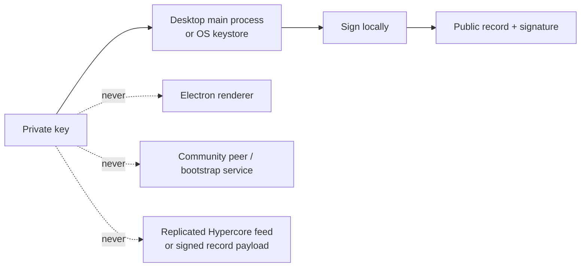

# Lesson 34: What Private Keys Must Never Leave

A private key is the authority to create a signature as its owner. If it is copied to a server, renderer process, log, or another person, that copy can impersonate the owner.



## What you already know

An API secret in browser JavaScript is effectively public because anyone can inspect it. A private signing key has the same problem, with worse consequences: it could authorize false records.

```ts
// Safe boundary: sign in trusted local code.
const signature = await signingService.sign(canonicalBytes);

// Unsafe: never send privateKey to a renderer or HTTP endpoint.
```

**Expected observation:** peers receive only a signature and public verification material. They can validate the claim but cannot produce a replacement signature.

## Peer Hours connection

The desktop main process keeps member private keys out of the renderer and community-peer public API, and signs only through its narrow local boundary. Protected OS storage is used when available; hardware-backed key custody remains a production hardening path, not a claim that every device has a hardware key.

## Takeaway

Replication should spread verifiable evidence, never the secret that creates it.

## Next lesson

Continue with [Lesson 35: What an Ed25519 signature proves](35-ed25519-signatures.md).
