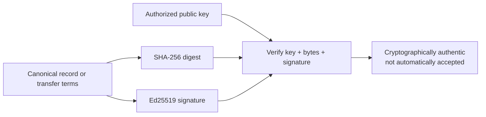

# Lesson 35: What an Ed25519 Signature Proves

An Ed25519 signature proves that the holder of a particular private key approved exact bytes. It does not prove that the action was fair, desired by the whole community, or even currently valid under every Peer Hours rule.



## One small example

```ts
const bytes = canonicalize({ minutes: 60, provider: "alex", recipient: "bri" });
const signature = sign(alexPrivateKey, bytes);

verify(alexPublicKey, bytes, signature); // true
verify(alexPublicKey, canonicalize({ minutes: 61, provider: "alex", recipient: "bri" }), signature); // false
```

**Expected observation:** modifying one minute breaks verification because the signature covers the exact canonical terms.

## Peer Hours connection

`@peer-hours/timebank-identity` recomputes canonical transfer bytes and a SHA-256 digest before it verifies an attestation. The records resolver also verifies member-authored envelope signatures and role provenance. Active keys must be scoped to the correct member and community; settlement and ledger rules add independent checks afterward.

## Takeaway

A valid signature proves authorship of exact data. It is one required check, not the entire trust decision.

## Next lesson

Continue with [Lesson 36: Why a transfer has two attestations](36-two-attestations.md).
