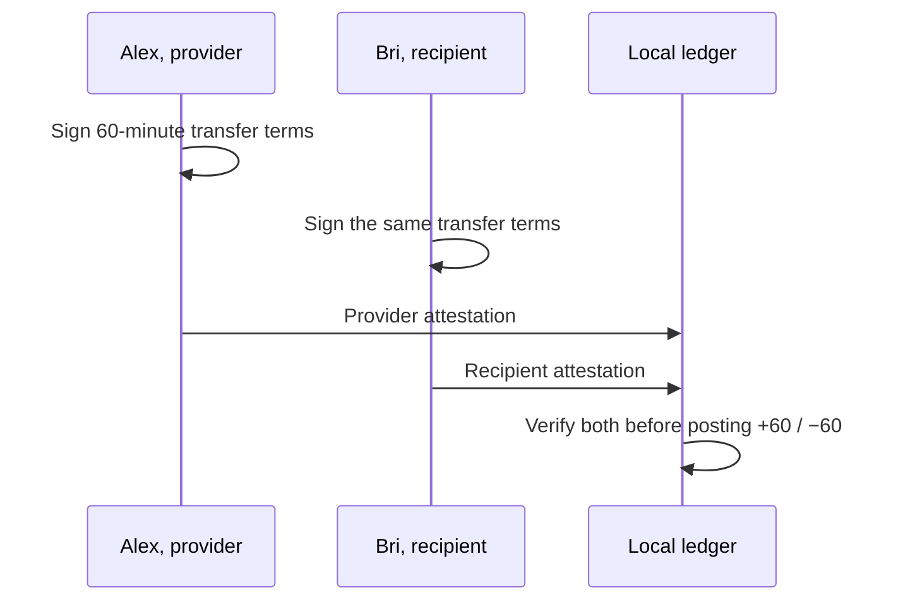

# Lesson 36: Why a Transfer Has Two Attestations

An exchange affects two people. Peer Hours therefore requires the provider and recipient to independently attest to the same transfer terms before the ledger derives balances.



## One small example

```ts
const transfer = {
  providerAttestation: alexSignature,
  recipientAttestation: briSignature,
};

ledger.apply(transfer); // only after both verify
```

**Expected observation:** one valid signature is insufficient. A missing, invalid, cross-community, or mismatched participant signature prevents settlement.

## Peer Hours connection

The ledger accepts a transfer envelope authored by either participant, but the envelope author is not a substitute for the second attestation. This distinction protects the agreement rule without giving a community peer authority to approve the exchange.

## Takeaway

Two attestations mean both affected people signed the same settlement, even if either one replicated its envelope.

## Next lesson

Continue with [Lesson 37: What a payload digest is](37-payload-digest.md).
