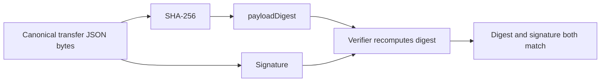

# Lesson 37: What a Payload Digest Is

A payload digest is a short fixed-length fingerprint of canonical data. Peer Hours stores a SHA-256 digest beside each transfer attestation so a verifier can check that the signature refers to the exact terms it reconstructed.



## One small example

```ts
const terms = canonicalize({ minutes: 60, sourceProposalId: "proposal-42" });
const digest = sha256base64url(terms);
const attestation = { keyId: "alex-laptop", payloadDigest: digest, signature };
```

**Expected observation:** if a receiver changes `minutes` from `60` to `61`, the recomputed digest differs and the signature over the original canonical bytes cannot verify for the changed terms.

## Peer Hours connection

The digest is not a secret and is not a replacement for the signature. It gives useful, explicit evidence about exactly which canonical transfer payload was signed, and helps the verifier reject malformed or altered attestation data. A matching digest alone never admits a transfer: authorization, dual acknowledgement, proposal linkage, both signatures, and ledger policy still apply.

## Takeaway

The digest is a fingerprint of the terms. It helps ensure every signature check is about the same immutable statement.

## Next lesson

Continue with [Lesson 38: Why replicated does not automatically mean trusted](38-replicated-is-not-trusted.md).
