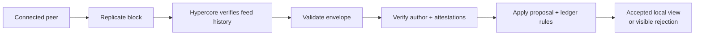

# Lesson 38: Why Replicated Does Not Automatically Mean Trusted

Replication answers “can I obtain this block and verify it belongs to this feed?” Trust answers “does this record satisfy Peer Hours rules?” They are deliberately different checks.



## One small example

```ts
const replicated = await memberFeed.readAll();
const result = resolveTimebankMemberFeeds(replicated);

// `replicated` may contain a transfer-shaped record.
// Only `result` tells the UI whether it was accepted into balances.
```

**Expected observation:** an altered, unsigned, unauthorized, duplicate-conflicting, or proposal-mismatched record may be stored locally for inspection but must not change the derived balance.

## Peer Hours connection

Community peers can retain and relay known member feeds, but they do not certify the records within them. Every desktop runs the same local validation path. This is how durable community infrastructure improves availability without becoming a record authority.

## Takeaway

“I received it” is a network fact. “It counts” is a protocol conclusion.

## Next lesson

The next lesson will examine the remaining community-authority questions without introducing gatekeeping.
