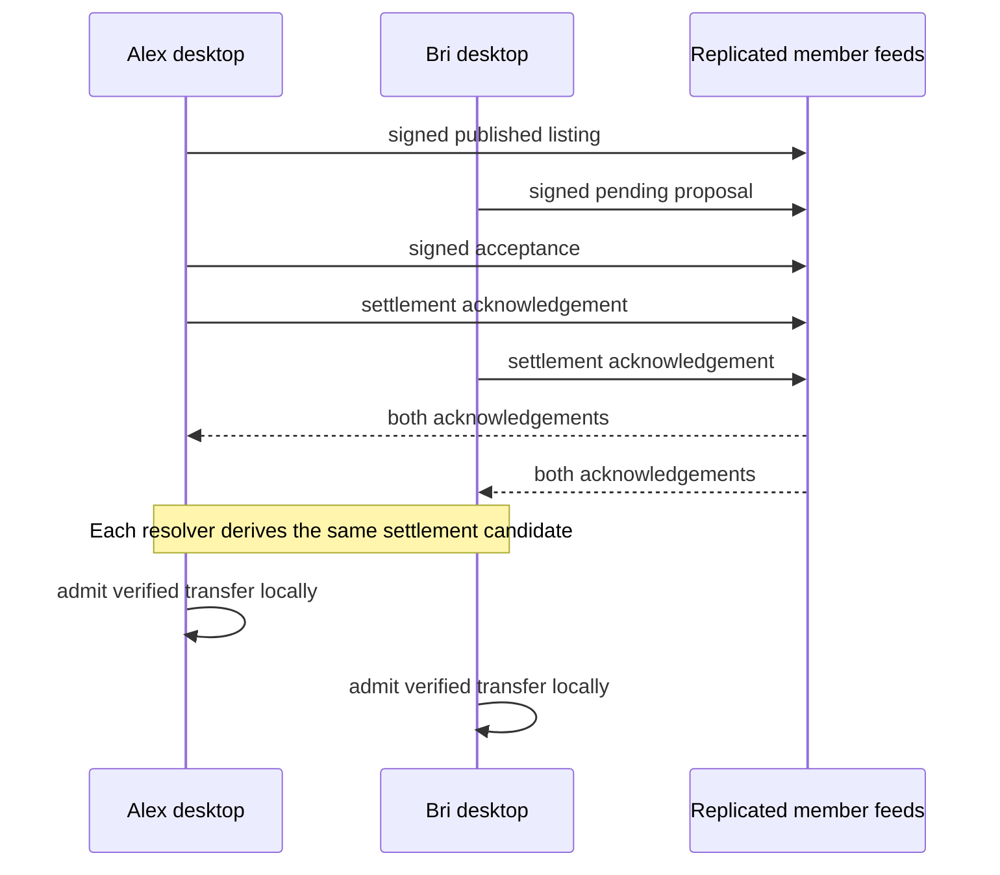

# Lesson 39: One Exchange, from Offer to Balance

An exchange is a chain of immutable statements, not one mutable row that changes status on a server.

## The stages

| Stage | Author | What it proves | Changes a balance? |
| --- | --- | --- | --- |
| Listing | Listing owner | An offer or request was published | No |
| Pending proposal | Proposal creator | One participant proposed exact terms | No |
| Acceptance | Other participant | The counterpart accepted those terms | No |
| Acknowledgement | Either participant | That participant says the exchange completed | No |
| Deterministic transfer | Derived from both acknowledgements | Both participants' signed terms support settlement | Yes, if locally admitted |

## Peer Hours connection

The desktop app publishes the member-owned records. The record resolver checks signatures, authorship, and links between stages. A community node can help replicas remain available, but it does not choose a winner or author the exchange.

**Verified today:** pending proposals, acceptances, acknowledgements, and deterministic settlement terms are represented as separate signed records and resolved locally.

**Not yet guaranteed:** the pilot defines one receipt as durable and two as resilient availability evidence, but it does not define an irreversible finality or community-wide dispute outcome.

## Takeaway

Reading the lifecycle in order prevents a common mistake: calling an accepted proposal or a single acknowledgement a completed ledger transfer.

## Next lesson

Continue with [Lesson 40: Proposing an exchange](40-proposing-an-exchange.md).
