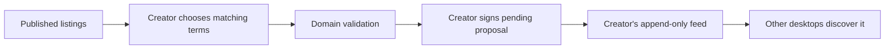

# Lesson 40: Proposing an Exchange

A pending proposal is the creator's signed request for a specific exchange. It names the community, both participants, two listings, and a positive whole-minute amount.



## One small example

```ts
await window.peerHours.member.createProposal({
  offerId: "alex-garden-help",
  requestId: "bri-bike-repair",
  minutes: 60,
});
```

**Expected observation:** the desktop rejects a missing listing, a non-positive or fractional duration, self-matching, cross-community terms, or an unpublished listing before it appends a record.

## Why a pending record has no acceptance field

Appending an immutable record cannot give its author a later opportunity to silently change who accepted. The creator publishes one pending proposal; the other participant later authors a separate acceptance record. This lets a resolver verify both claims independently.

**Verified today:** the desktop signs and publishes a pending proposal from a protected local member identity. The domain rules require the other participant to perform acceptance.

**Not yet guaranteed:** a proposal does not reserve time, prevent a participant from making other proposals, or promise that another peer has already seen it.

## Takeaway

A proposal is an invitation with exact terms, signed by its creator. It is not a balance change or a completed agreement.

## Next lesson

Continue with [Lesson 41: Accepting an exchange](41-accepting-an-exchange.md).
