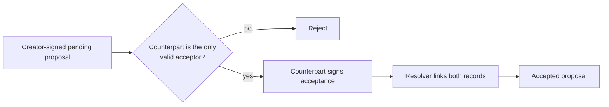

# Lesson 41: Accepting an Exchange

Acceptance is a second record authored by the participant who did not create the pending proposal. It preserves the proposal's immutable terms instead of replacing them.



## A useful mental model

Think of the acceptance as a signed reference:

```text
pending proposal ID + exactly matching community/people/listings/minutes
```

It is not permission for the creator to write `acceptedByMemberId` into their own earlier record.

**Expected observation:** a resolver rejects an acceptance authored by the proposal creator, an acceptance from an outsider, or an acceptance that changes the original terms.

## Peer Hours connection

The desktop checks a locally resolved pending proposal before requesting an acceptance. The record package independently checks the author and terms when every replica later resolves the feed history. UI checks improve feedback; the resolver supplies the important local rule.

**Verified today:** accepted proposals must be signed by the accepting participant and retain the source proposal's terms.

**Not yet guaranteed:** acceptance does not prove that either participant performed the service. Completion has a separate acknowledgement stage.

## Takeaway

Two parties contribute two immutable statements. That is stronger and more auditable than one mutable status field.

## Next lesson

Continue with [Lesson 42: Settlement acknowledgements](42-settlement-acknowledgements.md).
