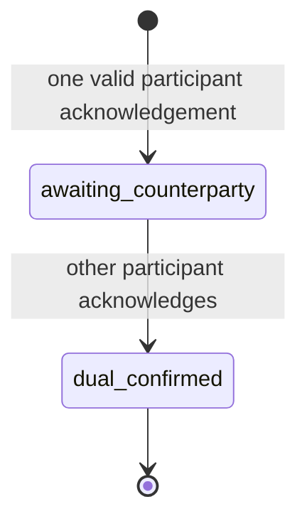

# Lesson 42: Settlement Acknowledgements

After an exchange is accepted and completed in the real world, each participant can publish an acknowledgement. An acknowledgement says, “I confirm completion of this accepted proposal's exact terms.”



## One small example

For proposal `proposal-7`, stable acknowledgement identities are derived per participant:

```text
proposal-7/acknowledgement/alex
proposal-7/acknowledgement/bri
```

The acknowledgement copies the proposal ID, community, provider, recipient, and minutes. A participant cannot acknowledge different terms under the same lifecycle step.

**Expected observation:** one valid acknowledgement resolves as `awaiting-counterparty` and creates no ledger posting. A second valid acknowledgement from the other participant resolves as `dual-confirmed`.

## Peer Hours connection

The desktop lets a ready local identity publish its own acknowledgement once for an accepted proposal. It refuses duplicates and refuses requests from a nonparticipant. The replicated resolver also verifies that the record author is the acknowledging participant.

**Verified today:** acknowledgements are signed immutable member-feed records and both participants are required for dual confirmation.

**Not yet guaranteed:** an acknowledgement is evidence of a claim, not a general dispute-resolution mechanism or a guarantee that another desktop has replicated it.

## Takeaway

Completion is deliberately a two-person statement. One participant's claim remains visible but does not settle the exchange.

## Next lesson

Continue with [Lesson 43: Deterministic settlement](43-deterministic-settlement.md).
