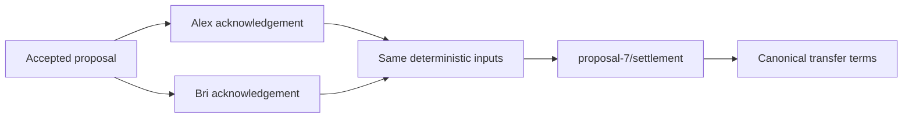

# Lesson 43: Deterministic Settlement

Once both acknowledgements exist, independent desktops must not invent competing transfers for the same accepted proposal. Peer Hours derives one normal transfer identity:

```text
${proposalId}/settlement
```



## Why determinism matters

Two peers may receive acknowledgements in different order or compose the candidate at different times. If both use the same accepted proposal and acknowledgement rules, they arrive at the same normal transfer ID and terms. Duplicate delivery can then be harmless; conflicting terms for the same ID are visible as an error.

```ts
const transfer = createDualConfirmedSettlementTransfer({
  proposal: acceptedProposal,
  acknowledgements: bothAcknowledgements,
  attestations: participantAttestations,
});
```

**Expected observation:** creation fails with only one acknowledgement, altered proposal terms, nonparticipant acknowledgements, or a transfer ID other than the deterministic ID.

**Verified today:** settlement composition checks dual confirmation and exact source terms before a ledger transfer can be admitted.

**Not yet guaranteed:** deterministic composition does not by itself deliver the record to every peer or decide a social dispute.

## Takeaway

Determinism turns “both parties confirmed the same exchange” into one auditable accounting candidate rather than a race between publishers.

## Next lesson

Continue with [Lesson 44: Signatures and authorizations](44-signatures-and-authorizations.md).
