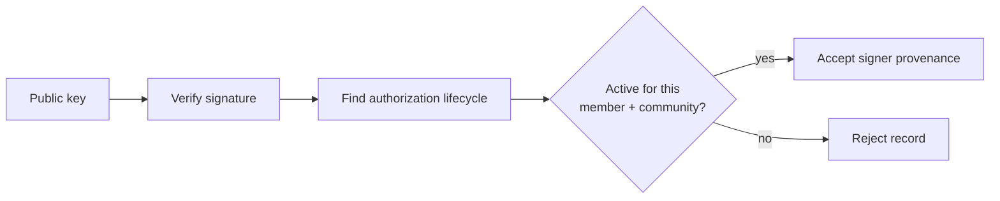

# Lesson 44: Signatures and Authorizations Work Together

A valid signature answers “did this key sign these bytes?” Authorization adds “was that key allowed to sign for this member and community?” Both questions matter.



## A focused example

```text
signature valid
  + key active for Alex in garden-community
  = eligible to sign Alex's garden-community record

signature valid
  + key active only for another community
  = reject this record
```

An authorization lifecycle can activate and later revoke a signing key. Reducers process immutable activation and revocation events so a desktop can answer whether a key is active without trusting the sender's claim.

**Expected observation:** a record signed by an unknown, revoked, wrong-member, or wrong-community key does not enter the resolved member state even if its cryptographic signature is mathematically valid.

**Verified today:** Peer Hours verifies member signatures and community-scoped key authorization before admitting member-originated domain records.

**Verified today:** root-signed device-key activation and permanent revocation records support overlapping key rotation through a member's declared feed. A root-key compromise still requires a new self-owned identity and an agreed correction/dispute process; that recovery UX is not yet complete.

## Takeaway

Cryptography proves control of a key; authorization connects that key to an allowed role in a specific community.

## Next lesson

Continue with [Lesson 45: Verifying a replicated record](45-verifying-a-replicated-record.md).
