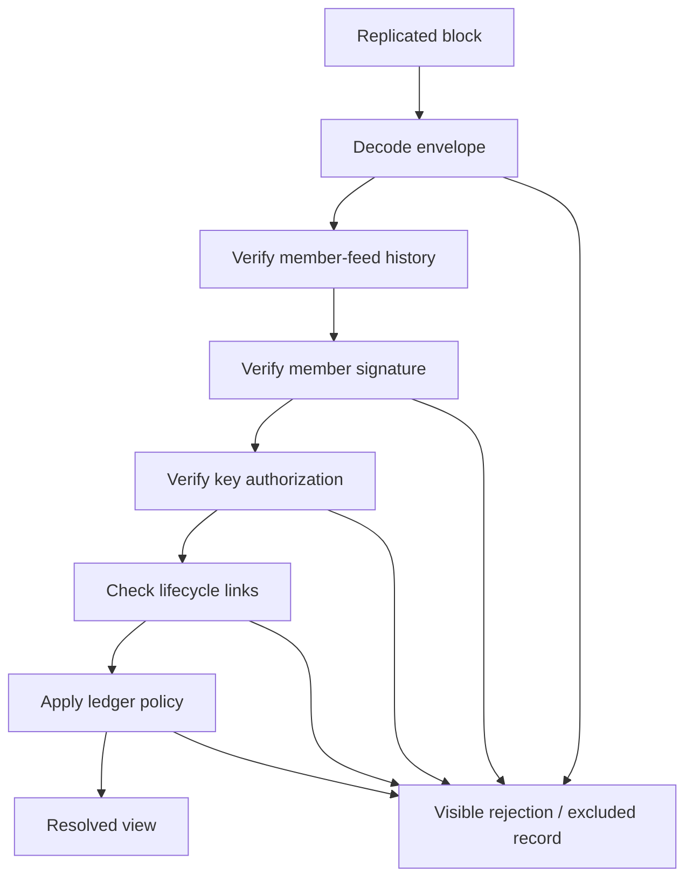

# Lesson 45: Verifying a Replicated Record

Replication gives a desktop bytes from an append-only feed. Resolution decides whether those bytes count in a particular local view.

## What the stages catch

- Envelope checks reject malformed record shape and scope disagreement.
- Feed and signature checks reject modified bytes or an author who did not sign the immutable terms.
- Authorization checks reject inactive, unknown, cross-member, or cross-community signing keys.
- Lifecycle checks reject a creator-authored acceptance, altered proposal terms, or a one-sided settlement.
- Ledger checks reject invalid accounting input such as a transfer past the configured negative balance boundary.

**Expected observation:** an excluded record can remain inspectable in raw history without changing a derived balance. This distinction helps users and operators diagnose why two local data sets differ.

**Verified today:** the resolver applies these categories of checks before it exposes accepted proposals, settlement confirmations, transfers, and balances.

**Not yet guaranteed:** independent replicas can still be at different points in replication. A successful local result is not a statement about all peers' views.

## Takeaway

Store first, validate explicitly, and derive the useful view. Never let transport success quietly become accounting success.

## Next lesson

Continue with [Lesson 46: Local ledger admission](46-local-ledger-admission.md).
