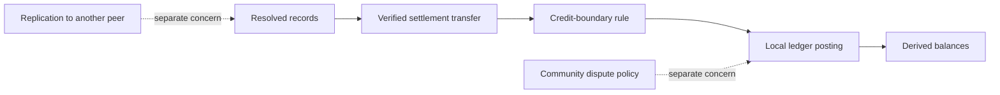

# Lesson 46: What Local Ledger Admission Means

Local ledger admission means one runtime verified a settlement transfer against the records and rules it currently has. It is intentionally narrower than “the whole network finalized this exchange.”



## Observable behavior

For a 60-minute transfer from provider Alex to recipient Bri, a locally admitted ledger derives `+60` for Alex and `-60` for Bri. It produces no posting when either participant attestation fails, the source proposal is missing, acknowledgements are incomplete, or the credit rule rejects the transfer.

```text
locally admitted = protocol and local policy checks passed here
replicated everywhere = a separate availability observation
socially final = a policy question that code does not settle today
```

**Verified today:** ledger admission requires deterministic settlement terms and authorized participant attestations, then applies the configured balance rule in deterministic transfer order.

**Not yet guaranteed:** there is no protocol-wide acknowledgement threshold, consensus procedure, or final community appeal process.

## Takeaway

Use “locally admitted” precisely. It is a strong, testable local claim without pretending that distributed social coordination is solved.

## Next lesson

Continue with [Lesson 47: Operating a community node](47-operating-a-community-node.md).
