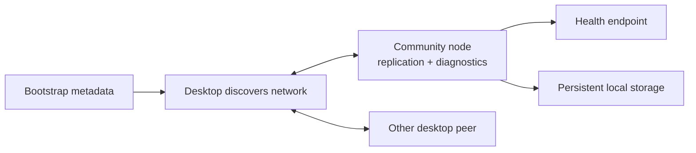

# Lesson 47: Operating a Community Node

A community node is independently operated, always-available infrastructure that retains and replicates network data for a timebank community. It improves reachability; it is not the owner of members or balances.

## Operator responsibilities

- Keep the process and its storage available and recoverable.
- Monitor the health endpoint and replication/runtime readiness.
- Configure a bounded diagnostics surface rather than exposing a control plane.
- Treat bootstrap metadata as discovery information, not as authority to alter member records.

**Expected observation:** before runtime storage opens, the community node health reports unavailable rather than claiming it is ready. Once open, diagnostics can report runtime status without becoming a record-admission service.

**Verified today:** the node exposes health and limited diagnostics while the peer runtime owns local storage and replication behavior.

**Not yet guaranteed:** automatic deployment, backup policy, and a shared operator runbook are not yet implemented protocol commitments.

## Takeaway

Operating a community node is an availability responsibility. It must not quietly become membership, balance, or truth authority.

## Next lesson

Continue with [Lesson 48: Observability and health](48-observability-and-health.md).
