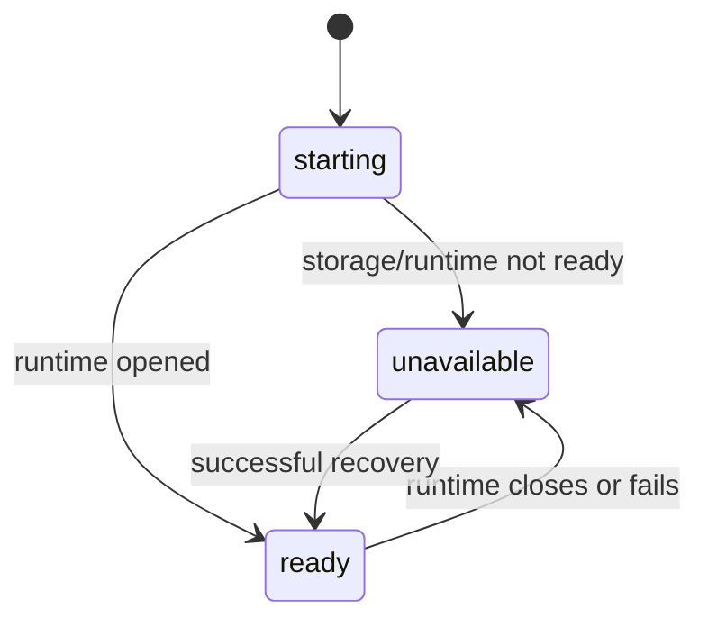

# Lesson 48: Observability and Health

“The process is running” is weaker than “the runtime opened its storage and can describe its current state.” Health information should make that distinction visible.



## Read health as a bounded diagnostic

A health response is useful for an operator when it answers questions such as:

- Did the community runtime open successfully?
- What is its readiness state and uptime?
- Are known diagnostics peers fresh, stale, or offline?

It must not be read as proof that every feed is replicated, every record is valid, or every member agrees with the state.

```text
ready health  !=  globally replicated
fresh peer    !=  trusted record author
offline peer  !=  deleted member or lost history
```

**Verified today:** the peer runtime produces immutable status snapshots, keeps an explicit start time, prevents negative uptime from a moving test clock, and distinguishes stale from offline peers.

**Not yet guaranteed:** health telemetry is not a consensus protocol and should not trigger automatic accounting decisions.

## Takeaway

Good observability reports the runtime's own condition honestly and leaves protocol and social conclusions to their proper layers.

## Next lesson

Continue with [Lesson 49: Offline, delayed, and duplicate records](49-offline-delayed-and-duplicate-records.md).
