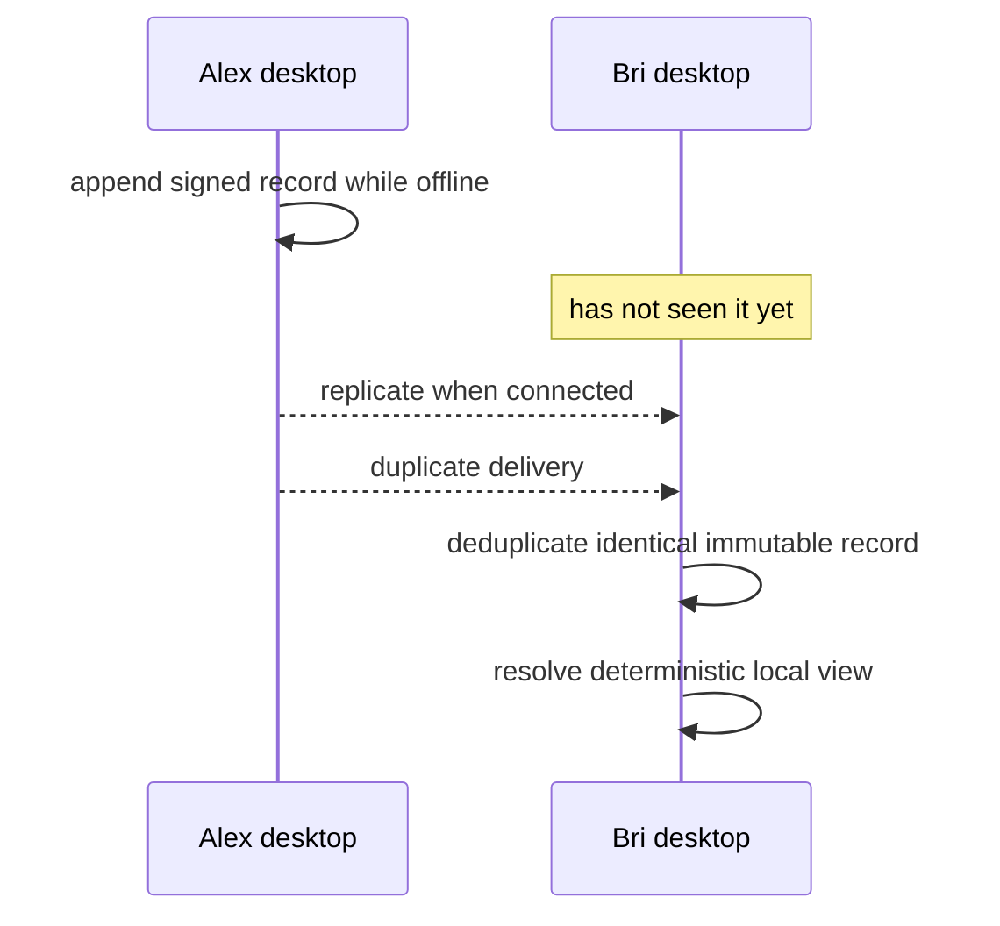

# Lesson 49: Offline, Delayed, and Duplicate Records

Local-first systems expect disconnected time and unordered delivery. The safe response is not to invent a central queue; it is to make immutable records and their reducers tolerate ordinary network timing.

## Three cases

| Delivery condition | Correct local behavior |
| --- | --- |
| Delayed | Show the honest, incomplete view until data arrives |
| Duplicate, identical | Keep one logical record |
| Same record ID, conflicting terms | Reject the conflict visibly |

**Expected observation:** reducers produce deterministic ordering from unordered delivery and reject conflicting immutable terms under one ID. A duplicate transfer does not double a balance.

**Verified today:** record and authorization reducers deduplicate identical history, reject conflicts, and resolve valid records in deterministic order.

**Not yet guaranteed:** an offline peer cannot know exactly when another peer will reconnect or guarantee a record's delivery without a defined replication policy.

## Takeaway

Delay is normal; duplication is normal; contradictory history is a problem to expose, not silently overwrite.

## Next lesson

Continue with [Lesson 50: Recovery boundaries](50-recovery-boundaries.md).
