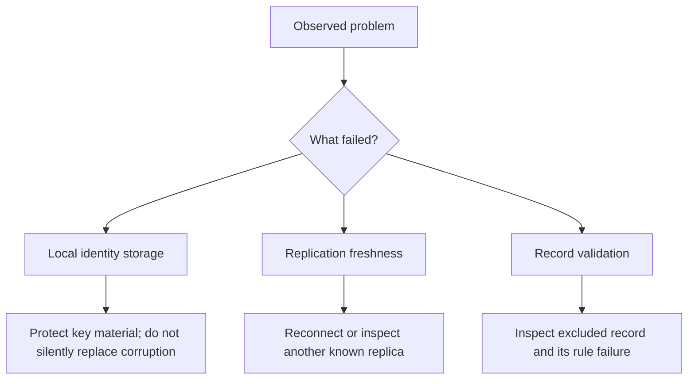

# Lesson 50: Recovery Boundaries

Local-first does not mean every failure is automatically recoverable. It means the local state, its limits, and the next useful action should be understandable.

## Important boundaries

- A secure-storage failure must not cause the desktop to generate a replacement identity and pretend it is the old member.
- A missing remote record may be a replication delay, not evidence that it never existed.
- A rejected record should stay explainable as raw history; erasing it would hide the reason a balance did not change.
- A community node outage reduces availability but must not grant it authority to repair history unilaterally.

**Expected observation:** unavailable protected storage or corrupted local identity material produces a visible blocked state and creates no new identity declaration or announcement.

**Verified today:** the desktop preserves protected identity material conservatively and exposes actionable identity and records-workspace errors instead of replacing damaged state.

**Not yet guaranteed:** backup, recovery phrases, device migration, and a community recovery process are product work that needs explicit design and community policy.

## Takeaway

Safe recovery begins by refusing to hide uncertainty. Preserve evidence, describe the boundary, and choose a reversible next action.

## Next lesson

Continue with [Lesson 51: Threat model and non-goals](51-threat-model-and-non-goals.md).
