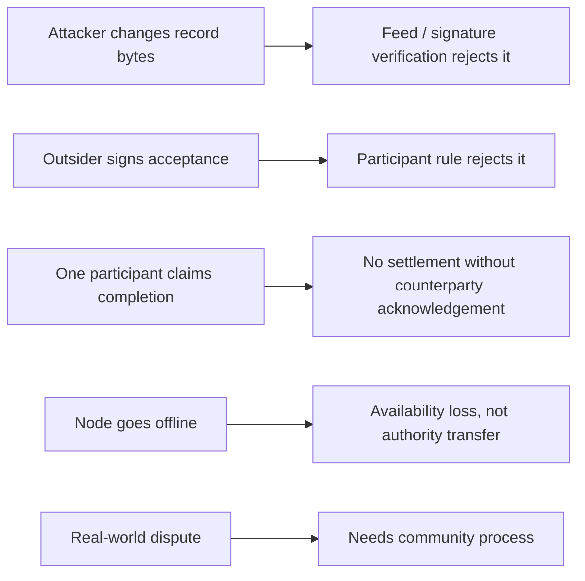

# Lesson 51: Threat Model and Non-Goals

The current protocol work makes specific records harder to forge or misapply. It does not claim to eliminate every operational or social risk.

## What the current checks help with

- Detecting changed immutable terms and invalid signatures.
- Restricting member records to active, authorized signing keys.
- Preventing a proposal creator from accepting their own proposal.
- Preventing a one-sided acknowledgement from producing an ordinary settlement transfer.
- Rejecting duplicate-conflicting record identities and invalid ledger postings.

## What they do not solve

- Whether real-world work was performed well or at all.
- Private-key theft on an already compromised device.
- Guaranteed delivery, global ordering, universal replication, or irreversible finality.
- Governance, mediation, member conduct, or a community's definition of an acceptable correction.

**Verified today:** the listed protocol checks are covered by implementation tests.

**Proposed direction:** communities can layer transparent human agreements and recovery procedures on top of the local verification model without appointing a central record authority.

## Takeaway

Security claims are useful only when bounded. Peer Hours protects certain data and authorship relationships; it does not turn social trust into a solved cryptographic problem.

## Next lesson

Continue with [Lesson 52: End-to-end walkthrough](52-end-to-end-walkthrough.md).
