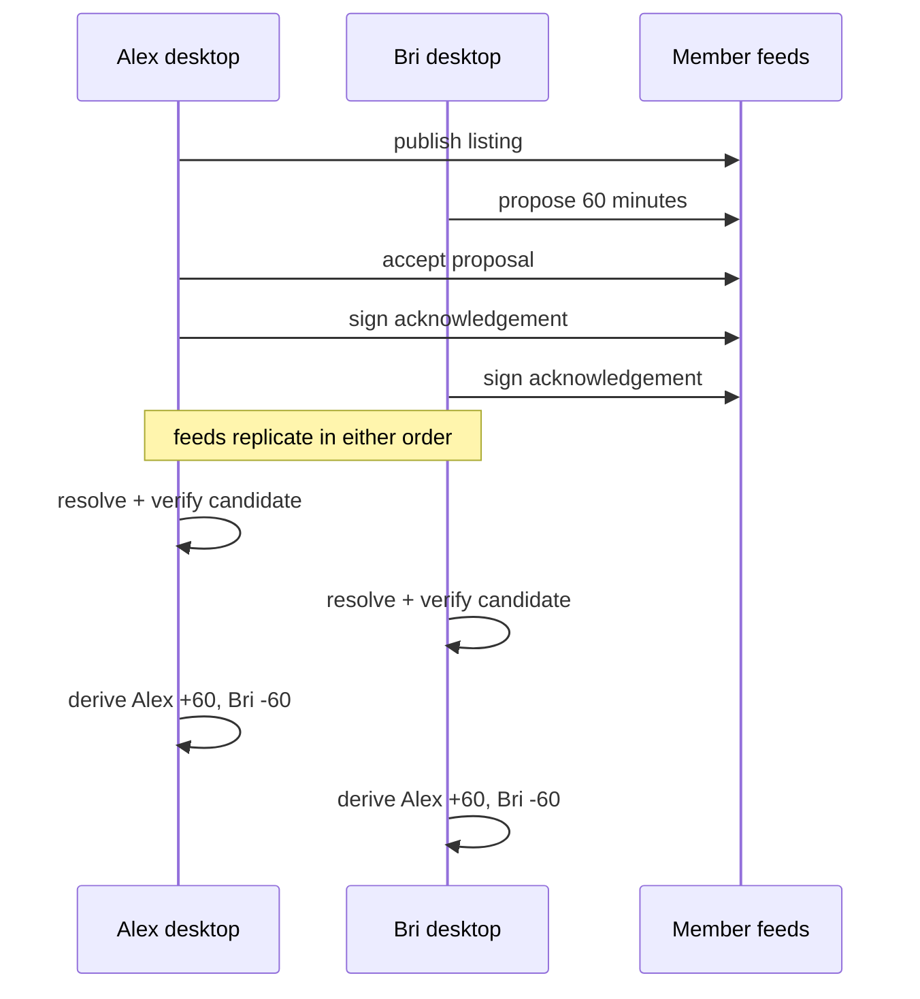

# Lesson 52: End-to-End Walkthrough

This capstone follows two member desktops through one 60-minute exchange. It connects the course's storage, replication, signature, and accounting ideas without adding a central server.

## Follow the evidence

1. Alex and Bri each use a protected local identity and member-owned feed.
2. Bri's pending proposal names the exact community, listings, participants, and 60 minutes.
3. Alex, the other participant, signs a separate acceptance.
4. After the real-world exchange, each signs their own acknowledgement.
5. Once both acknowledgements replicate, each resolver derives the same `${proposalId}/settlement` transfer candidate.
6. Member signatures, key authorizations, lifecycle links, dual attestations, and ledger rules are verified locally.
7. A valid transfer creates equal-and-opposite derived postings: Alex `+60`; Bri `-60`.

## What can differ between desktops

One desktop may be offline or simply have not replicated the newest record. It can therefore show an earlier honest stage while the other already sees dual confirmation. Once both have the same valid immutable records, deterministic resolution gives the same lifecycle and balance result.

**Verified today:** two independent member runtimes can replicate signed exchange records without a community node and resolve deterministic state using the shared packages.

**Not yet guaranteed:** this walkthrough is not proof of a globally finalized settlement or a replacement for a community's dispute and recovery agreements.

## Course takeaway

Peer Hours keeps evidence close to members, uses community nodes for availability, and makes each desktop verify what it counts. That combination is local-first—not a hidden central ledger.
