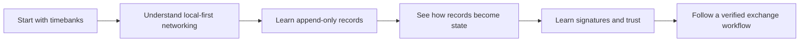

# Learn Peer Hours

This is a short-lesson course for web developers who know browsers, HTTP APIs, and databases but are newer to local-first replication, Hypercore, and peer-to-peer systems.

Do not try to read every document at once. Each lesson introduces one idea, then connects it to the next one.

## How to use this course

Each lesson aims for roughly 3–8 minutes. Look for these recurring sections:

- **What you already know** translates from a familiar client/server idea.
- **One small example** focuses on one behavior, not a full application.
- **Peer Hours connection** explains why the idea matters in this repository.
- **Verified today** and **Not yet guaranteed** keep implementation facts separate from future design.

## Reading the accuracy labels

This course deliberately does not use a diagram to turn a design goal into a fact. Watch
for these labels:

- **Verified today** describes behavior covered by the current repository's code and tests.
- **Proposed direction** describes a useful design idea that is not a protocol promise.
- **Not yet guaranteed** calls out an important boundary: for example, a locally admitted
  transfer is not a claim that every peer has replicated it or that a community has a final
  dispute-resolution policy.

The examples use names and small numbers to teach a concept. They are not production
records, credentials, or a substitute for a community's own agreements.

## Part 1 — Start with the people and the community

1. [What is a timebank?](01-what-is-a-timebank.md)
2. [What is a Peer Hours community?](02-what-is-a-community.md)
3. [Desktop app, community peer, and bootstrap service](03-desktop-app-and-community-node.md)
4. [What is a peer?](04-what-is-a-peer.md)
5. [Why members do not host servers](05-why-members-do-not-host-servers.md)
6. [What local-first means](06-what-local-first-means.md)
7. [Offline work and online settlement](07-offline-and-online-work.md)

## Part 2 — Replace the usual server mental model

8. [Where is the database?](08-where-is-the-database.md)
9. [Why the app keeps local data](09-local-app-data.md)
10. [What a community node is responsible for](10-community-node-responsibility.md)
11. [What a bootstrap endpoint does](11-bootstrap-endpoint.md)
12. [Why bootstrap is not the central server](12-bootstrap-is-not-central-authority.md)
13. [What happens when the desktop starts](13-desktop-startup.md)
14. [What happens when a peer connects](14-peer-connection.md)
15. [Why connection status is not a boolean](15-connection-status-is-not-a-boolean.md)

## Part 3 — Append-only storage and replication

16. [What is an append-only log?](16-append-only-log.md)
17. [Why records are not edited in place](17-no-in-place-edits.md)
18. [What a Hypercore key means](18-hypercore-key.md)
19. [What Corestore does](19-corestore.md)
20. [What replication means](20-replication.md)
21. [What happens while a peer is offline](21-offline-peers.md)
22. [What a record envelope is](22-record-envelope.md)
23. [What a record core is](23-record-core.md)

## Part 4 — From records to app state

24. [Raw records versus a useful screen](24-raw-records-and-useful-screens.md)
25. [Who is allowed to author a record?](25-who-authors-a-record.md)
26. [Why order-independent results matter](26-order-independent-results.md)
27. [What a member-key authorization is](27-member-key-authorization.md)
28. [What an accepted proposal is](28-accepted-proposal.md)
29. [What a transfer is](29-transfer.md)
30. [Why balance is derived instead of stored](30-derived-balance.md)
31. [How one transfer changes two balances](31-two-balances.md)

## Part 5 — Trust and signatures

32. [What a key pair is](32-key-pairs.md)
33. [What public keys are safe to share](33-public-keys.md)
34. [What private keys must never leave](34-private-keys.md)
35. [What an Ed25519 signature proves](35-ed25519-signatures.md)
36. [Why a transfer has two attestations](36-two-attestations.md)
37. [What a payload digest is](37-payload-digest.md)
38. [Why replicated does not automatically mean trusted](38-replicated-is-not-trusted.md)
39. The unresolved community-authority problem *(planned)*

## Planned later lessons

These lessons will be added as the corresponding desktop and protocol paths become stable.

### Part 6 — Future protocol and product lessons

40. How desktop members publish protocol records safely
41. Single-writer and multiwriter logs
42. Why per-member feeds help
43. What conflict resolution means here
44. What “settled” should mean to a member
45. What still needs community policy instead of code
46. How the first member workflow will be built

### Part 7 — Learning from the running system

47. Read the community bootstrap response
48. Inspect a record core
49. Run two local runtimes
50. Follow one record through replication
51. Read a resolved ledger view
52. Diagnose an unavailable community node
53. Explain a stale peer
54. Choose the next safe experiment

## Current implementation references

- [Peer runtime package](../../packages/peer-runtime/README.md)
- [Record-core replication](../record-replication.md)
- [Package architecture](../package-architecture.md)
- [Identity attestations](../identity-attestations.md)
- [Ledger settlement](../ledger-settlement.md)
