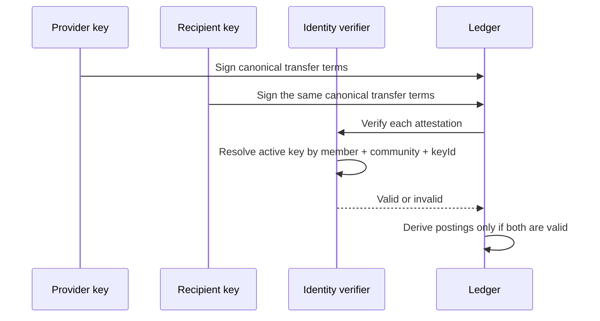
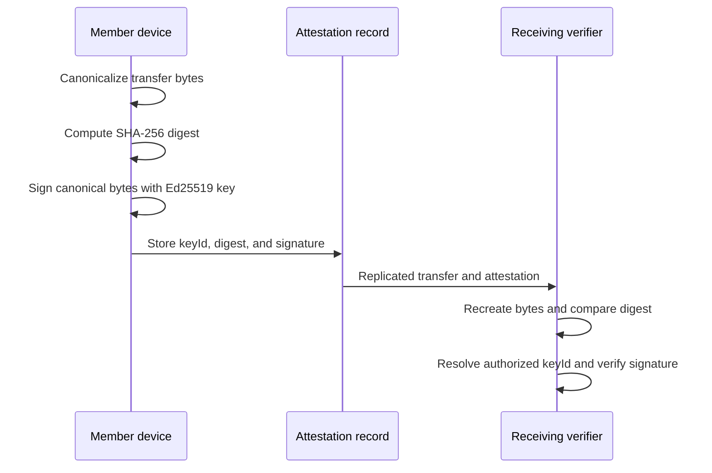

# Identity attestations

`@peer-hours/timebank-identity` supplies the first verification bridge between a ledger transfer and a community member’s signing key.

## Current boundary

- A member signing-key authorization belongs to one community and one member.
- The implementation accepts only active Ed25519 public keys.
- Each attestation stores the member's authorized Ed25519 `keyId`, a base64url SHA-256 `payloadDigest`, and an Ed25519 `signature`.
- The verifier signs deterministic transfer terms, excluding the attestation envelope so both participants sign identical bytes. It recomputes the digest before verifying the signature.
- Valid provider and recipient signatures are accepted; inactive, unknown, cross-community, member-mismatched, malformed, and tampered signatures are rejected.
- The ledger still owns its balance, idempotency, and reversal rules. Identity only verifies attestation authorization.

## Remaining protocol hardening

The verifier is intentionally local and in-memory. Replicated settlement still needs a formally versioned canonical JSON profile, community-issued authorization events, key rotation and revocation rules, and replicated storage for member-key authorizations. Private keys must remain local to a member’s device and never enter the renderer or a community node’s public API.
