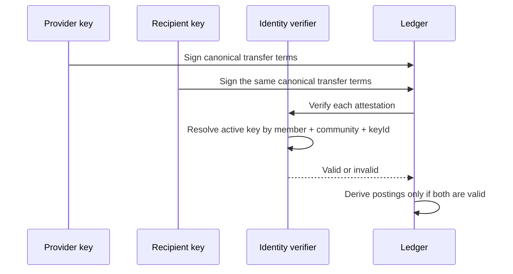
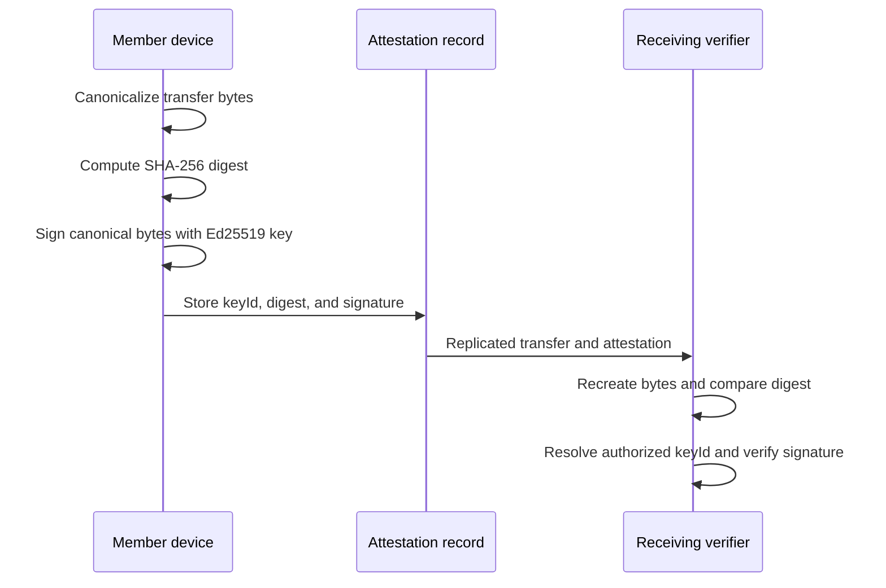

# Identity attestations

`@peer-hours/timebank-identity` supplies the first verification bridge between a ledger transfer and a community member’s signing key.



## Current boundary

Here is the smallest useful mental model for one attestation. The signature covers the canonical transfer terms; the surrounding object supplies the public key identifier and a digest that the receiving runtime recomputes:

```json
{
  "keyId": "alex-laptop-2026",
  "payloadDigest": "base64url-sha256-of-canonical-transfer-terms",
  "signature": "base64url-ed25519-signature"
}
```

- A member signing-key authorization belongs to one community and one member.
- Immutable authorization lifecycle events carry a stable event id, community, member, key id,
  UTC timestamp, and either an `activate` action with an Ed25519 public key or a `revoke` action.
- Receiving runtimes deterministically reduce an unordered event history by timestamp and event
  id. Repeated identical events are idempotent; conflicting records with the same event id are
  rejected rather than silently resolved.
- The implementation accepts only active Ed25519 public keys.
- Each attestation stores the member's authorized Ed25519 `keyId`, a base64url SHA-256 `payloadDigest`, and an Ed25519 `signature`.
- The verifier signs deterministic transfer terms, excluding the attestation envelope so both participants sign identical bytes. It recomputes the digest before verifying the signature.
- Valid provider and recipient signatures are accepted; inactive, unknown, cross-community, member-mismatched, malformed, and tampered signatures are rejected.
- The ledger still owns its balance, idempotency, and reversal rules. Identity only verifies attestation authorization.



## Root-signed device-key recovery

Self-owned member identities now have a concrete non-authoritative device-key lifecycle. The
member's root key signs a versioned canonical statement that activates a new device key or
permanently revokes an existing `keyId`. A new key can overlap the old key while a member moves
to another device. Once a revocation is in the replicated history, later activation of that same
key ID is rejected, including delayed replay.

The record resolver accepts a root-signed lifecycle statement only beside a matching root-signed
member-feed declaration for the same member and community. That proves provenance without giving
a community node, bootstrap endpoint, or another member an approval role. A root-key compromise
cannot be repaired under the same self-certifying member ID: the honest response is a new identity
plus the community's separately defined correction/dispute process.

Private keys remain local to protected device custody and never enter the renderer or a community
node's public API. Desktop wiring for creating, storing, and publishing lifecycle statements is a
separate follow-up; the shared protocol does not manufacture or export private keys.
