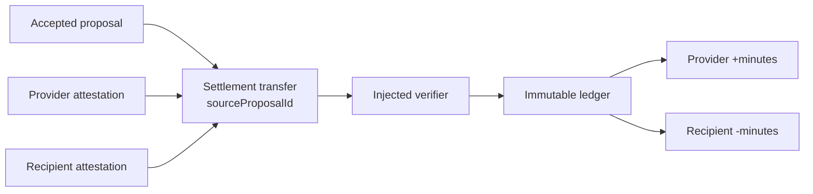

# Ledger settlement

`@peer-hours/timebank-ledger` is the first pure settlement boundary for Peer Hours. It is separate from listings and proposals: an accepted proposal expresses mutual agreement, while a verified ledger transfer derives time-credit balances.

## Current rules

- Transfers are scoped to one community and use positive whole `minutes`.
- A transfer has distinct provider and recipient members.
- Both participants must attest to the transfer, and an injected verifier must accept both attestations before it contributes postings.
- Every settled transfer references one accepted proposal. A proposal can settle at most once.
- Balances are derived from immutable, equal-and-opposite postings; no mutable balance is authoritative.
- Replaying the identical transfer is idempotent.
- A correction is a new, dual-attested reversal that swaps participants and uses the exact original minute amount. It never edits or deletes the original transfer.
- Valid transfers may be processed in any order and derive the same balances.

## Attestation boundary

The ledger requires each participant attestation to name a signing `keyId`, carry the SHA-256 `payloadDigest` of canonical transfer bytes, and include its signature. It accepts an injected verifier rather than a cryptography library. `@peer-hours/timebank-identity` provides the current in-memory Ed25519 verifier and community-scoped member-key authorization boundary. See [identity attestations](identity-attestations.md).

The authorization registry is not yet a replicated protocol record. A formally versioned canonical JSON profile and verified linkage from `sourceProposalId` to an accepted proposal in `@peer-hours/timebank-domain` are still required.

`@peer-hours/timebank-settlement` now provides the in-memory validation for that linkage: a normal transfer must exactly preserve an accepted proposal's community, source ID, participants, and minute amount. It still needs a replicated record resolver before it becomes a network-level guarantee. See [proposal settlement integration](proposal-settlement-integration.md).

Credit limits, disputes, multi-device keys, membership revocation, and replicated ledger persistence are intentionally deferred. Negative balances are currently allowed because balance-limit enforcement needs a deterministic concurrent-spend protocol.
