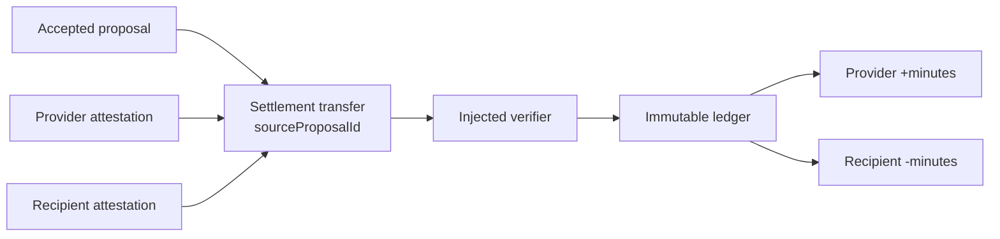

# Ledger settlement

`@peer-hours/timebank-ledger` is the first pure settlement boundary for Peer Hours. It is separate from listings and proposals: an accepted proposal expresses mutual agreement, while a verified ledger transfer derives time-credit balances.

## Current rules

- Transfers are scoped to one community and use positive whole `minutes`.
- A transfer has distinct provider and recipient members.
- Both participants must attest to the transfer, and an injected verifier must accept both attestations before it contributes postings.
- Every settled transfer references one accepted proposal. A proposal can settle at most once.
- Balances are derived from immutable, equal-and-opposite postings; no mutable balance is authoritative.
- Replaying the identical transfer is idempotent.
- A correction is a new, dual-attested reversal that swaps participants and uses the exact original minute amount. It never edits or deletes the original transfer.
- Valid transfers may be processed in any order and derive the same balances.

## Deliberate limits

The current verifier is an injected interface, not a cryptographic implementation. The next protocol layer must define a versioned canonical transfer payload, member key authorization, attestation key identifiers, and signature algorithms. It must also connect `sourceProposalId` to a verified accepted proposal from `@peer-hours/timebank-domain`.

Credit limits, disputes, multi-device keys, membership revocation, and replicated ledger persistence are intentionally deferred. Negative balances are currently allowed because balance-limit enforcement needs a deterministic concurrent-spend protocol.
