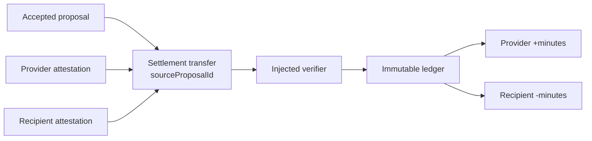

# Ledger settlement

`@peer-hours/timebank-ledger` is the first pure settlement boundary for Peer Hours. It is separate from listings and proposals: an accepted proposal expresses mutual agreement, while a verified ledger transfer derives time-credit balances.



## Current rules

- Transfers are scoped to one community and use positive whole `minutes`.
- A transfer has distinct provider and recipient members.
- Both participants must attest to the transfer, and an injected verifier must accept both attestations before it contributes postings.
- Every settled transfer references one accepted proposal. A proposal can settle at most once.
- A replicated settlement acknowledgement is only workflow evidence. It becomes
  `dual-confirmed` after both proposal participants sign matching acknowledgements, but neither
  one-sided nor dual-confirmed acknowledgement records create ledger postings; a separately
  dual-attested transfer remains required.
- Balances are derived from immutable, equal-and-opposite postings; no mutable balance is authoritative.
- Replaying the identical transfer is idempotent.
- A correction is a new, dual-attested reversal that swaps participants and uses the exact original minute amount. It never edits or deletes the original transfer.
- Valid transfers may be processed in any order and derive the same balances.

## Attestation boundary

The following compact transfer shape shows the separation between the immutable transfer terms and the two signatures over those terms:

```json
{
  "id": "transfer-42",
  "sourceProposalId": "proposal-42",
  "providerMemberId": "alex",
  "recipientMemberId": "bri",
  "minutes": 60,
  "providerAttestation": { "keyId": "alex-laptop", "payloadDigest": "…", "signature": "…" },
  "recipientAttestation": { "keyId": "bri-phone", "payloadDigest": "…", "signature": "…" }
}
```

The ledger requires each participant attestation to name a signing `keyId`, carry the SHA-256 `payloadDigest` of canonical transfer bytes, and include its signature. It accepts an injected verifier rather than a cryptography library. `@peer-hours/timebank-identity` provides the current in-memory Ed25519 verifier and community-scoped member-key authorization boundary. See [identity attestations](identity-attestations.md).

Self-owned device-key activation and revocation now use root-signed replicated lifecycle records, and the feed-aware resolver requires the declaring member feed to carry them. It also verifies the linkage from `sourceProposalId` to an accepted replicated proposal before locally admitting a normal settlement. The older caller-supplied authorization registry remains a compatibility boundary, not a community admission mechanism.

`@peer-hours/timebank-settlement` now provides the in-memory validation for that linkage: a normal transfer must exactly preserve an accepted proposal's community, source ID, participants, and minute amount. It still needs a replicated record resolver before it becomes a network-level guarantee. See [proposal settlement integration](proposal-settlement-integration.md).

The ledger defaults to a -50-hour (`-3000` minute) minimum balance. It applies ordinary settlements in stable transfer-ID order and excludes an over-limit settlement from derived postings with a visible `minimum-balance` rejection. The desktop now shows acknowledgement, attestation, local-admission, and receipt-backed durability states; it still needs member-facing rejected-transfer, correction/dispute, and concurrent-offline explanations. Disputes, private contact sharing, and a broader replicated policy protocol remain deferred.
