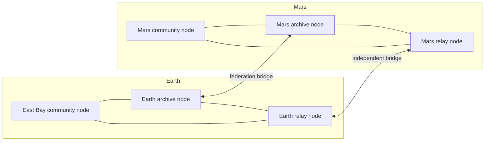
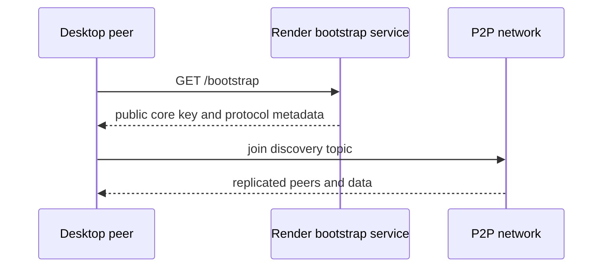
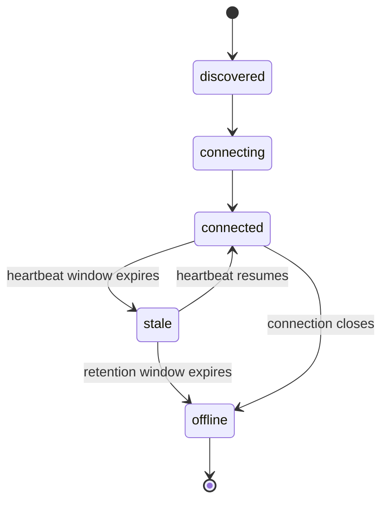

# Peer Hours Network Architecture

This is a living architecture note. It records the current direction for Peer Hours and should be revised as implementation and community needs make the design clearer.

## Purpose

Peer Hours is intended to be a reusable set of peer-to-peer tools for timebank communities.

The system is inspired by the Bay Area Community Exchange (BACE) timebank model: members offer and request services, exchange equal-valued time credits, and build community through participation rather than treating time as a conventional monetary commodity.

Peer Hours exists because this model can benefit from technology that is more resilient, portable, and adaptable to the needs of modern communities.

## Non-governing, organic network

Peer Hours is an open-source, not-for-profit project. The protocol is not meant to collect fees, sell access, or create a business that extracts money from timebank exchange. People and communities may voluntarily operate infrastructure, but participation must not depend on one required vendor, host, or organization.

There is no global governing authority. A compatible peer can validate signed records under transparent protocol rules, and people retain control over their own identities, local safety settings, and exchange decisions. Communities can develop shared customs and publish helpful information, but a community peer must not become an admission office, balance controller, or authority that decides whose record is real.

This is what lets the network spread organically. A person, cooperative, or new community should be able to operate compatible infrastructure, create or join an appropriately scoped community, and connect through available peers without waiting for a central organization to grant it access. Inter-community discovery and federation will need careful privacy and scope rules, but they must preserve this property.

Community peers are optional resilience infrastructure, not a prerequisite for protocol operation. When enough member desktops are online on the same discovery scope, they should be able to discover one another, connect directly, and replicate member-owned feeds without a Peer Hours community peer. Community peers make that experience more durable by retaining data, offering additional connection paths, and helping a returning member catch up after other desktops have gone offline.

## Core direction

Peer Hours should be a **federated, local-first timebank network**.

Regular members use the desktop application, which includes their local Peer Hours peer runtime. They do not need to run a separate server or maintain permanently online infrastructure.

Separate online nodes are operated by communities, cooperatives, nonprofits, or independent participants. These nodes replicate data, keep the network available, support synchronization, and help connected users discover one another.

```text
Desktop application
  ├── Member-facing UI
  ├── Embedded local peer runtime
  ├── Local identity and data
  ├── Offers and requests
  ├── Offline composition and browsing
  └── Synchronization when connected

Community nodes
  ├── Replicate listings and signed transactions
  ├── Keep data available while members are offline
  ├── Relay connected members
  ├── Support discovery within a community
  └── Participate in transaction validation
```

The system should not depend on one central application server, governing authority, or continuously available community peer, while still remaining practical for people who simply want to use a timebank.

## Current implementation boundary

Peer Hours has a working **replicated-read foundation**, not a production timebank yet. The following pieces are implemented and tested today:

- the Electron desktop owns persistent local peer storage and an embedded runtime;
- an always-on community peer owns persistent local peer storage, publishes bootstrap/discovery metadata, and exposes read-only diagnostics;
- connected runtimes replicate known member feeds directly through Corestore;
- pure packages model listing ownership, accepted proposals, Ed25519 transfer attestations, proposal-to-transfer matching, immutable record envelopes, deterministic record resolution, and derived ledger balances.

Each member runtime owns a separate writable member feed, and a receiving runtime can directly replicate a known member-feed key. A self-certifying identity can sign a declaration linking itself to that feed, and the resolver admits that root key for the member's signed records without a community authorization event. Its feed-aware API also rejects a domain record supplied from a feed the author did not declare. Connected runtimes can now exchange root-signed, expiring feed announcements over their shared discovery core; a valid announcement opens the named feed automatically for replication. The always-on community peer is simply another peer with durable storage: it has no human member identity, assists discovery and replication, and has no community record core, member-admission role, or special validity authority. A shared discovery-core key and the desktop workflow are still needed, so a desktop cannot yet safely publish a member profile, listing, proposal, identity record, or transfer into the resolved community view. See [open participation and agreement privacy](open-participation-and-agreement-privacy.md) for the decision that this protocol must not become membership approval.

At the current resolver boundary, an accepted proposal is admitted only when the accepting member authored its signed envelope. A settlement transfer is admitted only when either participant authored its signed envelope **and** the ledger validates the transfer's separate attestations from both participants. These are verified in-memory record rules, not proof that a desktop has a production network path to submit a record. The current node roster endpoint is also a diagnostic/development visibility aid, not evidence of a complete discovery, routing, or availability protocol.

This distinction matters: replication proves that bytes can be copied between connected runtimes. It does not by itself prove who was allowed to write them, whether an exchange is settled, whether policy accepted it, or whether the data is durably available across a node failure.

For the phased production path, success criteria, and unresolved decisions, see the [production roadmap](production-roadmap.md).

## Offline and online behavior

Offers and requests are asynchronous records. A member should be able to create, edit, and queue them while offline. They synchronize to one or more nodes when connectivity becomes available.

Economic settlement is different. A completed exchange should require the relevant parties to be online, either directly or through reachable nodes. Both parties sign the transaction, and the signed event is replicated before the exchange is considered finalized.

The working principle is:

> Offline actions may be prepared and shared later; economic settlement must be explicitly signed, synchronized, and recoverable.

This distinction avoids requiring members to be continuously connected while preserving a clear boundary around when a time-credit transaction becomes final.

## Nodes and federation

Nodes are deployable infrastructure, not required software for every member.

A node may be hosted on a small VPS, a home server, a Raspberry Pi, or another suitable environment. Different nodes may have different roles:

- A community node serving one local timebank
- A public relay node supporting connectivity
- An archive node preserving historical ledger data
- A private node operated by a cooperative or organization
- A lightweight node replicating only selected communities

The initial model should favor federated communities. Each community can choose its own discovery scope, community-node operators, local safety defaults, and credit policy through transparent protocol rules, while using shared software and protocols. It must not control whether a person may participate, silently impose a global ban list, or own a member's identity. Inter-community exchange can be added later rather than assumed from the beginning.

An always-on community peer is an infrastructure role, not a supervisory role. Its bootstrap metadata describes only `discovery`, `replication`, and `diagnostics`. It may foster community by staying reachable, relaying known feeds, carrying transparent public announcements in a future protocol, and helping peers meet; those helpful actions do not give it a special vote over member identities, records, balances, or local safety choices.

## Meshes, distance, and off-world communities

A Peer Hours community identifier describes its social and accounting scope; it is not a physical network route. `peer-hours/earth/US/CA/east-bay` means “the East Bay community's records and policies,” not “every East Bay machine must be directly connected to every other East Bay machine.”

A resilient federation should look like a web of overlapping replication paths rather than a single bidirectional beam between distant places. Always-on community, archive, and relay nodes can maintain several connections and copy the same signed record history. If one bridge disappears, another path can later synchronize the history. The signed record and its community scope stay the same regardless of which path carried it.



This is a future topology, not present behavior. The current runtime makes direct encrypted peer connections after discovery, exchanges signed expiring feed announcements over a shared discovery core, and can replicate the announced member feed between connected peers. It does not yet provide general multi-hop routing, automatic bridge selection, or delayed interplanetary transport. Any future bridge must make its replication scope, authority, privacy, and conflict policy explicit; a network path must never silently merge two communities' ledgers.

## Trust and accounting

Users should own their identities and sign the activity they create. Nodes provide availability, replication, discovery, and community coordination; they should not silently mutate a member's history or balance.

The likely accounting foundation is a signed, append-only event history rather than a mutable balance field. A completed exchange would record at least:

- The provider
- The recipient
- The amount of time credit
- A description or reference to the exchange
- Creation and completion timestamps
- References to related events
- Signatures from the relevant participants

Cryptography can establish who agreed to an event. It cannot establish that a service was safe, high quality, or honestly described. Trust, moderation, dispute resolution, and community policy remain necessary parts of the product.

## Likely applications

```text
apps/
├── desktop/       # Primary member-facing Electron + React application
├── node/          # Headless deployable replication node
└── admin/         # Possible community-operations interface (not member admission)
```

`desktop`, the headless `node`, the `dev-peers` simulator, and the shared `peer-runtime` package now exist. The desktop embeds a local peer runtime; the always-on community peer provides persistent storage, bootstrap metadata, and peer status; and `dev-peers` provides real independent runtimes plus development-only roster registration for UI work. The desktop now has a drawer-based application shell, with network diagnostics isolated in its own workspace. The pure `timebank-domain`, `timebank-settlement`, `timebank-ledger`, `timebank-identity`, and `timebank-records` packages now define agreement, proposal-to-transfer validation, settlement, key lifecycle, feed provenance, and immutable-record resolution rules. Member runtimes own member feeds; the community peer deliberately does not because it has no human member identity. Application records, peer announcements, and the member-facing workflow are not yet wired. The admin application should be added when its first concrete workflows are understood.

## Local development topology

The intended development setup has three peers:

```text
Desktop app
  └── embedded local peer runtime

Development node
  └── separate test fixture running the node application

Network node
  └── independently deployed community or replication node
```

The development community node exists to make local testing repeatable. The deployed community node represents always-available infrastructure operated for a timebank community. The desktop should be able to connect to community nodes through its embedded peer runtime, while the UI reports community-node identities, peer connection state, and replication status.

The local `dev-peers` application also makes an explicit `register`/`unregister` request to the node's `/dev/peers` route so the UI can exercise a labeled simulated roster. That roster is not a transport graph: a `source: "simulated"` entry is neither proof of a Hyperswarm session nor proof of replicated records. The route is disabled by default and becomes available only when both the node and simulator explicitly use `ENABLE_DEV_PEER_REGISTRATION=true`. It is still unauthenticated local development infrastructure and must remain disabled for a publicly reachable community node.

## Possible shared packages

These are concrete and potential boundaries. The current packages cover the initial agreement, authorization, settlement-linkage, and balance rules:

```text
packages/
├── timebank-domain/     # Member profiles, listings, and exchange consent
├── timebank-identity/   # Member-key lifecycle records and Ed25519 verification
├── timebank-ledger/     # Attested time-credit transfers and derived balances
├── timebank-records/    # Immutable event envelope and deterministic timebank resolver
├── timebank-settlement/ # Accepted-proposal to settlement-transfer validation
├── sync/          # Replication and conflict handling
├── protocol/      # Network message formats and serialization
└── policy/        # Community-configurable rules
```

Packages should be created when there is a real reuse case or a stable domain boundary. We should avoid creating a generic `core` package simply because the repository has a `packages/` directory.

The current member-key events are deterministic, replicated-ready records; they do not yet establish self-owned key and identity continuity. A future self-owned identity protocol must establish that relationship without introducing a community admission authority before these records can be trusted from the network.

## First useful prototype

The first product milestone is network visibility and confidence. Before implementing offers, requests, or balances, the desktop app and node should make connectivity understandable and testable. A member should be able to see whether they are connected, which nodes and peers are available, whether synchronization is progressing, and what needs attention when it is not.

This should include both a polished member-facing status experience and structured node-level observability. The status model should distinguish local connectivity, node reachability, peer sessions, replication state, and application-level synchronization rather than collapsing them into one boolean.

Runtime uptime belongs beside those signals, not above them. The current runtime snapshot includes an instance start time and clock-derived uptime duration; a future restart count and independent probes can add operational context. None of those signals can prove external reachability, live peer sessions, current replicated data, or settlement readiness. See [runtime observability](runtime-observability.md) for the intended operational interpretation and current API boundary.

The first vertical slice should remain narrow and complete:

1. Start a local node and establish its identity.
2. Fetch community bootstrap metadata from a configured community node.
3. Start simulated peers and display them in the desktop network tree.
4. Discover and display actual live peer connections where transport permits.
5. Replicate a small test event between peers.
6. Show connection state, last-seen timestamps, sync progress, simulated-peer source, and errors in the desktop app.
7. Exercise disconnect, reconnect, delayed peer, and persistence-restart cases.
8. Only then begin the first offer/request workflow.

This should reveal the real boundaries between the desktop app, node, protocol, identity, listings, and ledger before those boundaries become packages.

## Questions to resolve over time

- Is each community an isolated ledger, or can communities interoperate?
- What exactly constitutes a node quorum or transaction acknowledgment?
- Can a member configure multiple nodes for redundancy?
- What happens when two devices make conflicting offline edits?
- How are lost devices, key rotation, and account recovery handled?
- Can trusted relays act on behalf of members who are rarely online?
- How will the implemented -50-hour limit behave across concurrent offline histories and replication acknowledgement?
- Can hours be donated to individuals, groups, or a community pool?
- Which information is private, member-visible, community-visible, or public?
- How are disputes, fraud, harmful behavior, and invalid transactions handled?

These questions should be answered through small experiments and community conversations rather than settled prematurely in the repository structure.

## Default network bootstrap

The initial desktop experience should use a default Render-hosted **bootstrap service** that is separate from every community peer. The desktop connects to a small public bootstrap endpoint over HTTPS, reads configured public discovery metadata, and then joins the corresponding Holepunch discovery topic.



The bootstrap endpoint is a rendezvous mechanism, not the authority for all Peer Hours data. It does not run a peer, persist member data, relay feeds, approve identities, or decide record validity. The discovery-core key may be shared publicly. A separate community peer owns persistent peer storage and should keep that core identity stable across restarts using durable storage.

Today, the runtime checks that bootstrap returns a successful HTTP response and structurally validates a complete manifest: nonblank community ID and display name, a positive protocol version, a fixed-length hexadecimal discovery-core key, the narrow `bootstrap` role, a discovery-metadata capability, optional community-peer diagnostics URL, and HTTP(S) fallback bootstrap URLs. It does **not** yet authenticate the endpoint or verify a signed manifest. A production bootstrap design needs an explicit trust policy such as pinned keys, signed manifests, or another verifiable community-distribution mechanism.

## Community naming

Peer Hours communities use hierarchical identifiers that scale from global networks to local timebanks:

```text
peer-hours/<scope>/<country>/<region>/<community>
```

The canonical terrestrial root is `earth`, rather than `world`. This keeps Earth communities explicit while leaving room for future off-world roots such as `peer-hours/mars/...` without changing the meaning of existing identifiers.

Examples:

```text
peer-hours/earth
peer-hours/earth/US
peer-hours/earth/US/CA
peer-hours/earth/US/CA/east-bay
peer-hours/earth/US/CA/east-bay/oakland
```

Non-geographic communities can use an `online` branch:

```text
peer-hours/earth/online/software
peer-hours/earth/online/caregivers
peer-hours/earth/online/language-exchange
```

Geographic segments should use stable uppercase codes where applicable, such as `US` and `CA`; human-facing display names remain separate from canonical identifiers. For example:

```json
{
  "communityId": "peer-hours/earth/US/CA/east-bay/oakland",
  "displayName": "Oakland Timebank",
  "parentCommunity": "peer-hours/earth/US/CA/east-bay"
}
```

The hierarchy organizes discovery and federation but does not imply a shared ledger. Each community may have its own discovery topic, community nodes, listings, ledger, and locally chosen safety defaults. Participation is not controlled through membership approval or a global ban list. Parent communities may later provide directories or federation between child communities without controlling their local accounting.

### Peer connection lifecycle

Peer status is intentionally more detailed than a binary online/offline flag:



The current runtime emits `connecting`, `connected`, `stale`, and `offline`, and exposes aggregate Hyperswarm `connecting` and `connected` counters through the status API. The `discovered` state is reserved for the future discovery layer, when a peer can be identified before a connection handshake begins.
