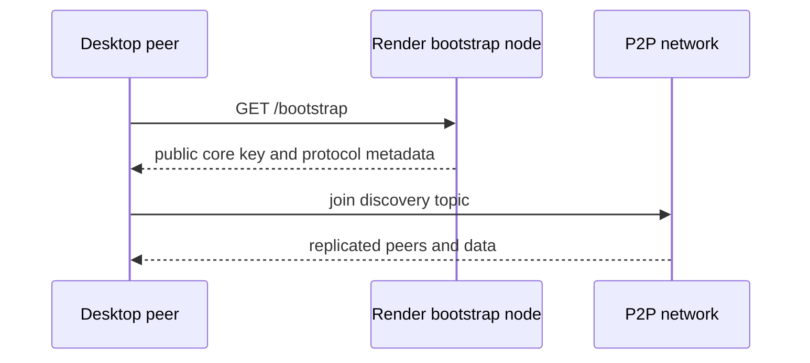
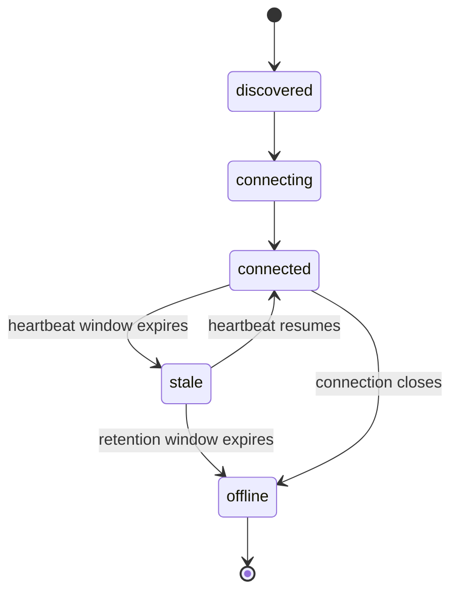

# Peer Hours Network Architecture

This is a living architecture note. It records the current direction for Peer Hours and should be revised as implementation and community needs make the design clearer.

## Purpose

Peer Hours is intended to be a reusable set of peer-to-peer tools for timebank communities.

The system is inspired by the Bay Area Community Exchange (BACE) timebank model: members offer and request services, exchange equal-valued time credits, and build community through participation rather than treating time as a conventional monetary commodity.

Peer Hours exists because this model can benefit from technology that is more resilient, portable, and adaptable to the needs of modern communities.

## Core direction

Peer Hours should be a **federated, local-first timebank network**.

Regular members use the desktop application, which includes their local Peer Hours peer runtime. They do not need to run a separate server or maintain permanently online infrastructure.

Separate online nodes are operated by communities, cooperatives, nonprofits, or independent participants. These nodes replicate data, keep the network available, support synchronization, and help connected users discover one another.

```text
Desktop application
  ├── Member-facing UI
  ├── Embedded local peer runtime
  ├── Local identity and data
  ├── Offers and requests
  ├── Offline composition and browsing
  └── Synchronization when connected

Community nodes
  ├── Replicate listings and signed transactions
  ├── Keep data available while members are offline
  ├── Relay connected members
  ├── Support discovery within a community
  └── Participate in transaction validation
```

The system should not depend on one central application server, while still remaining practical for people who simply want to use a timebank.

## Offline and online behavior

Offers and requests are asynchronous records. A member should be able to create, edit, and queue them while offline. They synchronize to one or more nodes when connectivity becomes available.

Economic settlement is different. A completed exchange should require the relevant parties to be online, either directly or through reachable nodes. Both parties sign the transaction, and the signed event is replicated before the exchange is considered finalized.

The working principle is:

> Offline actions may be prepared and shared later; economic settlement must be explicitly signed, synchronized, and recoverable.

This distinction avoids requiring members to be continuously connected while preserving a clear boundary around when a time-credit transaction becomes final.

## Nodes and federation

Nodes are deployable infrastructure, not required software for every member.

A node may be hosted on a small VPS, a home server, a Raspberry Pi, or another suitable environment. Different nodes may have different roles:

- A community node serving one local timebank
- A public relay node supporting connectivity
- An archive node preserving historical ledger data
- A private node operated by a cooperative or organization
- A lightweight node replicating only selected communities

The initial model should favor federated communities. Each community can control its own membership, moderation, policies, and credit rules while using shared software and protocols. Inter-community exchange can be added later rather than assumed from the beginning.

## Trust and accounting

Users should own their identities and sign the activity they create. Nodes provide availability, replication, discovery, and community coordination; they should not silently mutate a member's history or balance.

The likely accounting foundation is a signed, append-only event history rather than a mutable balance field. A completed exchange would record at least:

- The provider
- The recipient
- The amount of time credit
- A description or reference to the exchange
- Creation and completion timestamps
- References to related events
- Signatures from the relevant participants

Cryptography can establish who agreed to an event. It cannot establish that a service was safe, high quality, or honestly described. Trust, moderation, dispute resolution, and community policy remain necessary parts of the product.

## Likely applications

```text
apps/
├── desktop/       # Primary member-facing Electron + React application
├── node/          # Headless deployable replication node
└── admin/         # Possible community administration interface
```

`desktop`, the headless `node`, the `dev-peers` simulator, and the shared `peer-runtime` package now exist. The desktop embeds a local peer runtime; the community node provides persistent storage, bootstrap metadata, and peer status; and `dev-peers` provides real independent runtimes plus development-only roster registration for UI work. The admin application should be added when its first concrete workflows are understood.

## Local development topology

The intended development setup has three peers:

```text
Desktop app
  └── embedded local peer runtime

Development node
  └── separate test fixture running the node application

Network node
  └── independently deployed community or replication node
```

The development community node exists to make local testing repeatable. The deployed community node represents always-available infrastructure operated for a timebank community. The desktop should be able to connect to community nodes through its embedded peer runtime, while the UI reports community-node identities, peer connection state, and replication status.

## Possible shared packages

These are potential boundaries, not a commitment to create all of them now:

```text
packages/
├── identity/      # Keys, identities, and device authorization
├── listings/      # Offers and requests
├── ledger/        # Signed time-credit transactions and balances
├── sync/          # Replication and conflict handling
├── protocol/      # Network message formats and serialization
└── policy/        # Community-configurable rules
```

Packages should be created when there is a real reuse case or a stable domain boundary. We should avoid creating a generic `core` package simply because the repository has a `packages/` directory.

## First useful prototype

The first product milestone is network visibility and confidence. Before implementing offers, requests, or balances, the desktop app and node should make connectivity understandable and testable. A member should be able to see whether they are connected, which nodes and peers are available, whether synchronization is progressing, and what needs attention when it is not.

This should include both a polished member-facing status experience and structured node-level observability. The status model should distinguish local connectivity, node reachability, peer sessions, replication state, and application-level synchronization rather than collapsing them into one boolean.

The first vertical slice should remain narrow and complete:

1. Start a local node and establish its identity.
2. Fetch community bootstrap metadata from a configured community node.
3. Start simulated peers and display them in the desktop network tree.
4. Discover and display actual live peer connections where transport permits.
5. Replicate a small test event between peers.
6. Show connection state, last-seen timestamps, sync progress, simulated-peer source, and errors in the desktop app.
7. Exercise disconnect, reconnect, delayed peer, and persistence-restart cases.
8. Only then begin the first offer/request workflow.

This should reveal the real boundaries between the desktop app, node, protocol, identity, listings, and ledger before those boundaries become packages.

## Questions to resolve over time

- Is each community an isolated ledger, or can communities interoperate?
- What exactly constitutes a node quorum or transaction acknowledgment?
- Can a member configure multiple nodes for redundancy?
- What happens when two devices make conflicting offline edits?
- How are lost devices, key rotation, and account recovery handled?
- Can trusted relays act on behalf of members who are rarely online?
- Are negative balances allowed, and are debt limits community-configurable?
- Can hours be donated to individuals, groups, or a community pool?
- Which information is private, member-visible, community-visible, or public?
- How are disputes, fraud, harmful behavior, and invalid transactions handled?

These questions should be answered through small experiments and community conversations rather than settled prematurely in the repository structure.

## Default network bootstrap

The initial desktop experience should use a default Render-hosted bootstrap node. The desktop connects to a small public bootstrap endpoint over HTTPS, reads the node's public network/core key, and then joins the corresponding Holepunch discovery topic.



The bootstrap endpoint is a rendezvous mechanism, not the authority for all Peer Hours data. The public key may be shared; private signing material must remain on the node. The Render node's identity should be stored on persistent storage so restarts do not change the default network identity unexpectedly.

## Community naming

Peer Hours communities use hierarchical identifiers that scale from global networks to local timebanks:

```text
peer-hours/<scope>/<country>/<region>/<community>
```

The canonical terrestrial root is `earth`, rather than `world`. This keeps Earth communities explicit while leaving room for future off-world roots such as `peer-hours/mars/...` without changing the meaning of existing identifiers.

Examples:

```text
peer-hours/earth
peer-hours/earth/US
peer-hours/earth/US/CA
peer-hours/earth/US/CA/east-bay
peer-hours/earth/US/CA/east-bay/oakland
```

Non-geographic communities can use an `online` branch:

```text
peer-hours/earth/online/software
peer-hours/earth/online/caregivers
peer-hours/earth/online/language-exchange
```

Geographic segments should use stable uppercase codes where applicable, such as `US` and `CA`; human-facing display names remain separate from canonical identifiers. For example:

```json
{
  "communityId": "peer-hours/earth/US/CA/east-bay",
  "displayName": "East Bay Timebank",
  "parentCommunity": "peer-hours/earth/US/CA"
}
```

The hierarchy organizes discovery and federation but does not imply a shared ledger. Each community may have its own discovery topic, community nodes, membership rules, listings, ledger, and moderation policies. Parent communities may later provide directories or federation between child communities without controlling their local accounting.

### Peer connection lifecycle

Peer status is intentionally more detailed than a binary online/offline flag:



The current runtime emits `connecting`, `connected`, `stale`, and `offline`. The `discovered` state is reserved for the future discovery layer, when a peer can be identified before a connection handshake begins.
