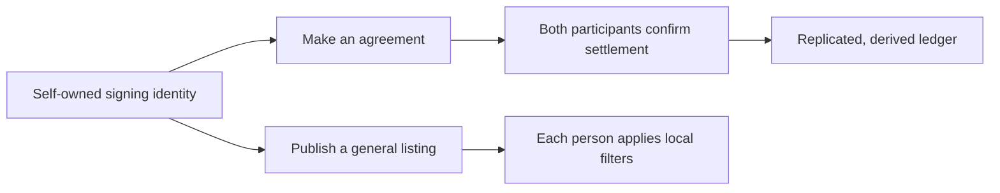
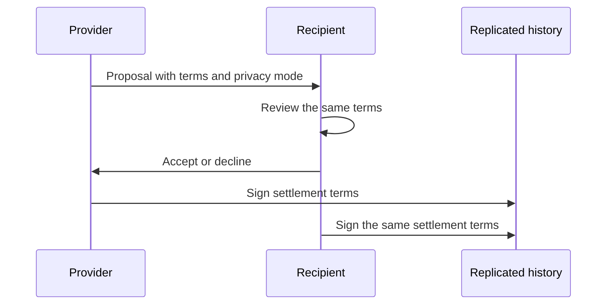

# Open participation and agreement privacy

This is a living product decision record. It distinguishes the intended Peer Hours protocol from code that is already verified and from work that is still proposed.

## Guiding principle

> Peer Hours is open to participation. People choose what to share, whom to trust, and whether to exchange; community nodes replicate records but do not decide who may exist.

## Decisions

### Identity and participation

- There is no membership approval prerequisite, administrator-controlled admission list, or global ban list.
- A person owns their signing identity. Their private signing material stays under their control; a community node must not impersonate them or own their balance.
- One underlying identity may participate across communities. Community-specific profiles, listings, and exchange records remain scoped to their community.
- An email address is core private identity metadata. It is never visible by default, is not replicated in public records, and does not need up-front verification for someone to participate.
- Two people may explicitly and mutually consent to exchange email addresses as part of an agreement. Neither person should be able to disclose the other person's email through the protocol without that consent.
- Contact outcomes may later be represented as transparent, advisory signals. They are not grounds for automatic removal, hidden suppression, or loss of identity.

### Visibility, safety, and messaging

General offers and requests may be community-visible: a chosen display name, a short title or description, and a broad area are appropriate examples. Exact addresses, phone numbers, email addresses, detailed availability, and personal notes are sensitive details and stay private unless their owner deliberately shares them.

Every desktop should provide user-controlled filtering with sensible defaults: local mute/block controls, clear explanations, and visible configuration. The default must not silently hide people through a global reputation score or a network-wide ban list. Community-provided safety or contact signals may be optional inputs to a member's local configuration, never invisible authority over participation.

Messaging is a future, dedicated protocol/package boundary. The first messaging scope should be exchange-thread communication rather than an unrestricted public inbox or global chat. It must not be smuggled into listing or settlement records.

### Agreements, privacy, and settlement

An exchange agreement must include its privacy choice before either participant accepts it. The proposal and later settlement describe the same agreed terms; if a term changes, the participants create a new agreement.

| Privacy mode | Decision | Information visible outside the participants |
| --- | --- | --- |
| `private-details` | Default | Ledger-relevant facts needed by the protocol may remain visible; description, contact details, addresses, scheduling, and notes are private to the participants. |
| `community-visible` | Optional, requires agreement by both participants | The agreed exchange terms can be readable to community participants. |
| Fully confidential | Future work | Hiding participants and amount from other replicas requires confidential-ledger design that Peer Hours does not implement today. |

Settlement requires confirmation from both participants. A submitter's envelope signature identifies who published an immutable record; it never replaces the provider and recipient settlement attestations.

The shared credit boundary is **-50 hours** (`-3000` minutes) per member within a community ledger. It is an economic rule, not an identity, publishing, or visibility rule: reaching the limit must not remove someone from the network, their listings, or their ability to contribute.

## Implementation-alignment audit — 2026-07-18

“Verified” means checked-in code and tests implement the listed behavior. It does not imply a deployed production network.

| Decision | Verified code today | Current deviation | Proposed work |
| --- | --- | --- | --- |
| Open participation, no membership approval | There is no node HTTP membership-approval endpoint. Domain profiles no longer have an active/inactive state, and listing publication and exchange rules check only the relevant owner or participant relationship. | Identity verification still relies on a supplied community-scoped authorization list. That is a temporary verifier input, not an acceptable participation gate. | Define self-owned identity records and user-selected filtering, then replace the supplied authorization-list model. |
| Self-owned signing identities | Ed25519 record and transfer signatures are checked against community-scoped member/key bindings; private keys are not node API data. | Key lifecycle events do not yet have a replicated, self-owned issuer/ownership protocol, and member devices cannot yet publish feeds. | Persist device-owned keys safely and add member-feed replication. |
| One identity across communities | All current records are correctly scoped to one community. | Profiles and key bindings are community-scoped; there is no root identity/profile relationship across communities. | Define one root identity with community-specific profiles and visibility settings. |
| Private email + mutual exchange | No email field is currently replicated by the timebank protocol. | No private identity metadata, dual-consent record, encryption, or email-sharing UI exists. | Add private identity storage and dual-consent contact sharing without public email replication. |
| Public general listings; private sensitive details | Listings currently carry only basic title/minute data. | There is no visibility model, broad-area field, sensitive-detail encryption, or UI. | Add explicit profile/listing visibility and participant-only detail handling. |
| User-controlled filters; no global ban list | No global ban list or hidden reputation score is implemented. | No desktop mute/block settings or advisory-signal subscription exists. The source-level inactive profile gate conflicts with this direction. | Build local filters with sensible defaults and optional, transparent advisory inputs. |
| Exchange-thread messaging | No messaging protocol is present. | None; this is intentionally absent. | Create a dedicated package only when exchange-thread requirements are concrete. |
| Both participants confirm settlement | The ledger requires exactly one valid attestation from provider and recipient; record resolution preserves that boundary. | No desktop member workflow or replicated member publishing exists. | Build proposal-to-settlement UI, pending state, acknowledgement, and interruption recovery. |
| -50-hour boundary | The ledger applies ordinary settlements in stable transfer-ID order with the fixed current `-3000` minute minimum, retaining over-limit settlements as rejected. | This is not yet wired through replicated member feeds, desktop explanations, or a finality/acknowledgement protocol. Transfer-ID ordering is an implementation rule that needs protocol-level review before broader deployment. | Test end-to-end concurrent/offline behavior and make pending/rejected reasons visible in the desktop. |
| Mutual agreement on privacy mode | Proposal acceptance and settlement enforce agreement/dual-attestation mechanics. | Privacy mode is absent from proposal, transfer, canonical signing payloads, resolver, and UI. | Include immutable privacy terms in signed agreements and implement `private-details` first. |

## Next implementation sequence

1. Make source-level participation rules match open participation rather than centrally interpreted member status.
2. Define a self-owned root identity plus community-specific public profile, with private email held outside public replication.
3. Add signed proposal terms for privacy mode and mutual contact-sharing consent.
4. Exercise the existing -50-hour boundary across replicated, concurrent histories and expose its pending/final outcomes honestly.
5. Build member-owned feed replication and the first end-to-end offer, proposal, dual confirmation, and settled balance flow.

The messaging package, contact-health reports, confidential-ledger design, recovery, and cross-community accounting are deliberately deferred until the narrower workflow is real and testable.
