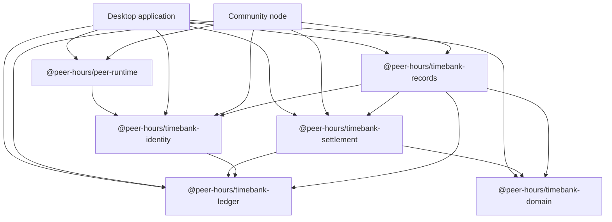

# Package architecture

Peer Hours packages are small, explicit domain or runtime boundaries. A package exists only when at least two applications or future integrations need the same behavior. The goal is not to maximize reuse through generic abstractions; it is to keep the rules that matter independently testable and easy to compose.

## Current packages

| Package | Owns | Must not own |
| --- | --- | --- |
| `@peer-hours/peer-runtime` | Local peer lifecycle, Hypercore storage, Hyperswarm discovery, bootstrap metadata, signed feed-announcement transport, and status snapshots | Timebank policy, balances, member authorization, or UI state |
| `@peer-hours/timebank-domain` | Members, listings, proposals, and acceptance rules | Cryptography, persistence, transport, or balances |
| `@peer-hours/timebank-identity` | Self-owned identity/feed declarations, signed expiring announcements, member-key lifecycle records, canonical transfer terms, and Ed25519 verification | Private-key storage or network persistence |
| `@peer-hours/timebank-ledger` | Transfer invariants, verified settlement application, postings, balances, and reversals | Cryptographic algorithms, proposal lookup, or mutable account balances |
| `@peer-hours/timebank-records` | Immutable record envelope, record mappings, replay/conflict detection, and deterministic resolved views | Self-owned identity/feed policy, private keys, or transport ownership |
| `@peer-hours/timebank-settlement` | Exact linkage from one accepted proposal to one normal ledger transfer | Signature verification, balance derivation, or replicated record lookup |

## Composition boundary

Applications and future replicated-record adapters compose the packages:

1. `timebank-domain` produces an accepted proposal.
2. `timebank-records` validates the replicated envelope and resolves that proposal and the member-key lifecycle history.
3. `timebank-settlement` verifies the proposed transfer retains the accepted terms.
4. `timebank-identity` reduces key records and verifies envelope signatures and both participant attestations.
5. `timebank-ledger` accepts verified transfers and derives balances.

The current implementation resolves these boundaries in memory and has a live member-feed transport between runtimes. `timebank-records` additionally assigns envelope authorship: the accepting member authors an accepted proposal; either transfer participant may author a settlement transfer, while `timebank-ledger` still requires attestations from both participants. `peer-runtime` transports only identity-validated, expiring feed announcements; it does not decide whether a member should publish one or what their records mean. The next integration layer is the member-facing workflow, without moving business rules into the desktop app, community peer, or transport code.

## Dependency direction

Dependencies point toward narrower, more stable rules. Runtime networking stays separate from timebank rules except for one deliberately narrow dependency: `peer-runtime` uses `timebank-identity` to reject malformed, altered, or expired feed announcements before opening a remote feed. The domain package has no package dependencies; the ledger has no cryptography dependency; identity depends on ledger only to use the ledger's transfer contract; and settlement composes domain and ledger without altering either.

`timebank-records` is the first intentional composition package: it depends on the pure timebank packages to turn immutable replicated records into a deterministic local view. It does not depend on `peer-runtime`, so Hypercore storage remains replaceable.

New packages need a concrete cross-application use case and a single, explainable responsibility. Prefer an adapter in an application until that boundary is proven.
