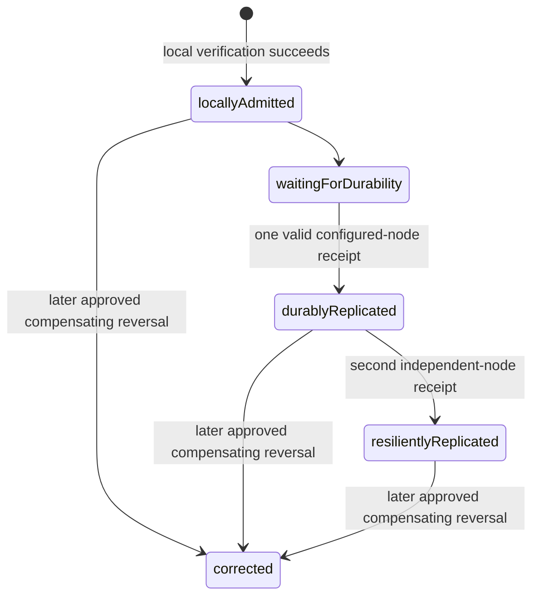
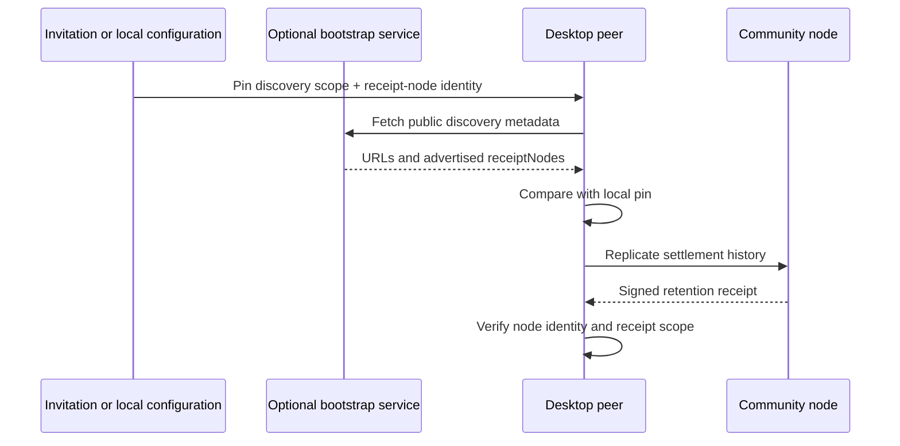

# Pilot operating policy

This living decision record fixes the default operating promises for the first limited Peer Hours pilot. It deliberately separates three things:

- **Verified today** — behavior implemented and covered by repository checks.
- **Pilot decision** — an agreed product or community rule that operators and the UI must follow.
- **Implementation work** — a required capability that is not evidence of the rule on its own.

The policy applies to one small, consenting community. It does not give a community node, bootstrap service, operator, or vendor authority over a member's identity, record history, balance, or dispute outcome.

## 1. What a settlement label promises

Peer Hours must not use one word such as "settled" to conceal different facts. The pilot uses the following labels, in order:

| Label | Promise to the member | What it does **not** promise |
| --- | --- | --- |
| `locally admitted` | This desktop verified the accepted proposal, both participant attestations, deterministic transfer terms, and ledger rules, and includes the transfer in its local derived balance. | That any other runtime has received the record, that a node has stored it, or that a social dispute is impossible. |
| `durably replicated` | One configured community node at its matching manifest-pinned endpoint has signed a verified retention receipt for the settlement transfer. | Survival of a second independent infrastructure failure, global delivery, or a node vote on validity. |
| `resiliently replicated` | Two configured community nodes in separate declared failure domains have each signed verified retention receipts from their matching pinned endpoints for the same settlement transfer. | Irreversible finality, unanimous network agreement, or resolution of a dispute. |

`locally admitted` is the accounting state. A desktop applies the locally admitted transfer to its local derived balance; it must not withhold a valid participant agreement merely because a community node is temporarily offline. The other labels are availability evidence only. The UI must say **waiting for durable replication** after local admission and before the first valid receipt. It must never call any of these states "final," "irreversible," or a bank-like guarantee.

For safety, a missing, malformed, unreachable, unpinned, or unqueried receipt remains **waiting for durable replication**. The current desktop bounds a refresh to 256 transfer lookups; a transfer outside that bound remains waiting rather than inheriting an optimistic status.

**Verified today:** a desktop can publish the deterministic, dual-attested transfer and locally admit it under shared resolver and ledger rules.

**Pilot decision:** one receipt earns `durably replicated`; two independent receipts earn `resiliently replicated`. Neither threshold grants infrastructure the power to approve, reject, alter, or remove a transfer.

**Current protocol addition:** community nodes persist a separate Ed25519 receipt identity and issue a fresh `peer-hours/replication-receipt/v1` signed receipt only after locally resolving, ledger-admitting, and retaining the transfer. A receipt names the community, transfer ID, digest of the complete canonical transfer (including attestations), retention time, node ID, public key, and signature. Desktop verification compares the receipt against a pinned configured identity; it does not trust a key returned by an arbitrary endpoint. Pilot operation still requires end-to-end deployment and failure testing.

## 2. Node identity and bootstrap trust

The pilot runs at least two independently operated community nodes for one discovery scope. Each node has its own durable storage, operator credentials, receipt-signing identity, backup location, and declared failure domain. Two processes on the same account, host, or backup system do not count as independent for the resilient threshold.

Bootstrap remains optional public discovery metadata. A manifest may advertise `receiptNodes` entries containing a stable `nodeId`, public key, and receipt URL, but a bootstrap response cannot itself authorize a node, transfer, or member. A desktop must retain a member-installed or invited **pinned discovery scope and expected node identities**. It may use a later bootstrap response only when the response is consistent with that pin or is explicitly reviewed by the member. A changed discovery key or node identity is a visible trust-change event, not a silent refresh.

**Pilot decision:** invitations/configuration are the trust anchor for a first connection. A bootstrap outage, changed response, or unsigned metadata must not erase a known community configuration or silently substitute a new one.

**Current protocol addition:** the bootstrap manifest supports optional `receiptNodes`, whose `nodeId` is the SHA-256 hex digest of its Ed25519 SPKI-DER public key and whose public key is base64url encoded. Bootstrap deployment configuration supplies an equivalent `COMMUNITY_RECEIPT_NODES` list. Safe node-identity rotation remains future work; until it exists, operators distribute changes through an independently verifiable, member-visible channel and record the change in the incident log.

## 3. Backup, restore, and availability defaults

The pilot treats a community node's full durable data directory as important replicated state. It is not a database authority and it is not sufficient as a backup by itself.

| Control | Pilot default |
| --- | --- |
| Community nodes | At least two, operated in distinct failure domains. |
| Backups | Encrypted, complete snapshots of each node's durable data at least daily; no partial live-Corestore copies. |
| Backup access | Decryption material is held by at least two named, trusted community custodians; no single vendor account is the only recovery path. |
| Retention | Keep at least 30 daily restore points and one tested monthly restore point for the pilot. |
| Recovery objective | Target recovery of a failed community node within 24 hours; disclose a missed target to members. |
| Restore drill | Before inviting members, then at least quarterly: restore into a fresh directory/host, start it, and compare known history with an independent healthy peer. |

Do not copy individual files into a live Corestore, delete a node data directory as routine maintenance, or call a new empty cache a recovery. A restored node must catch up through normal replication and operators must document the observed catch-up state. A node's HTTP health response only says its local runtime is available; it is not evidence that the restore is complete.

## 4. Privacy, retention, and support records

The pilot default is `private-details`: public replicated records contain only the protocol facts currently necessary to validate listings and settlements. Email addresses, exact addresses, phone numbers, free-form work notes, credentials, and dispute evidence must not be inserted into public listings, proposal descriptions, settlement metadata, diagnostic endpoints, logs, or unencrypted backups.

The current replicated ledger is append-oriented. Therefore the pilot does not promise deletion of a signed settlement from all replicas. A mistaken or contested exchange is handled through new evidence and, when appropriate, a new compensating reversal—not mutation or deletion of the original history.

Pilot operators retain only operational data needed for availability and incident response. Status probes should record service availability, storage, version, and replication-health summaries, not member activity content. Access to backups and operational logs is limited to named operators and is reviewed after any incident. Before enrollment, members receive a plain-language description of what is replicated, what remains local, where backups may live, and the limits of deletion.

**Implementation work:** private contact sharing, encryption policy enforcement, export tooling, and a confidential-ledger design are not yet implemented. The pilot must not advertise them as present.

## 5. Corrections and disputes

Cryptographic validity and durability do not decide whether work was performed well, safely, or at all. Operators may facilitate communication and preserve an incident record, but they cannot rewrite feeds, alter balances, forge a member signature, or unilaterally issue a reversal.

The pilot process is:

1. A member can report a concern through the published support channel.
2. The support team records only the minimum private evidence needed for the case and states who can see it.
3. The participants may agree to a corrective, dual-attested reversal under the existing ledger rules. That creates a new immutable record linked to the original; it does not erase it.
4. If they do not agree, the community's human process may recommend support, mediation, safety steps, or future exchange limits. It cannot silently alter the protocol history or claim that an unresolved record disappeared.
5. A case outcome and any policy consequence are communicated to the affected people without exposing unnecessary private details.

This is a conservative boundary for the limited pilot. Community moderation, identity recovery, and enforceable safety workflows require separate, member-visible design rather than a hidden administrator override.

## 6. Policy and release versioning

Every pilot community publishes a short policy document with a semantic `policyVersion`, effective date, change summary, support contact, durability threshold, operator list, privacy/retention terms, correction process, and incident channel. Members see the version that applies before they join or continue exchanging. A policy update never retroactively changes signed transfer terms or makes a previously valid record disappear.

Protocol compatibility is separate from community policy. A client must make a protocol-version mismatch visible and refuse record shapes it cannot verify. Until a policy-version field is signed into the relevant records, the UI must describe a policy version as community guidance, not cryptographic proof that both participants saw it.

Pilot releases use a named release owner, reviewed changelog, source revision, dependency/security review, and a rollback plan. Operators deploy one node at a time where practical, verify `/health` and `/status`, and retain the previous known-good release until the new release is observed healthy. No release step may delete durable data as a shortcut.

## 7. Pre-enrollment checklist

Before inviting the first member, the community confirms all of the following:

- Two community nodes, distinct failure domains, durable storage, and named operators are in place.
- Each member receives a verifiable discovery scope and expected node identities; bootstrap fallback URLs are configured but not treated as the trust anchor.
- The `locally admitted`, `durably replicated`, and `resiliently replicated` wording is present in the product and support materials, with no "final" claim.
- A complete encrypted backup has been restored into a fresh environment and compared with a healthy independent peer.
- The plain-language privacy/retention notice, correction path, support contact, incident channel, and current `policyVersion` are available.
- A release owner has run the repository validation suite and recorded the deployed revision and rollback procedure.
- The community has rehearsed loss of one node, bootstrap outage, lost desktop with unsynced drafts, and a mutually agreed correction.

## Open choices after the pilot baseline

The following need community input and implementation design; the pilot must not silently make them policy through infrastructure defaults:

- a member-safe root-key/device recovery and rotation flow;
- how policy version and privacy mode become immutable signed agreement terms;
- legally appropriate retention duration and the handling of private case evidence in each jurisdiction;
- capacity and credit-boundary policy under concurrent offline settlement; and
- whether any advisory safety signal is useful without creating a hidden or central participation gate.
