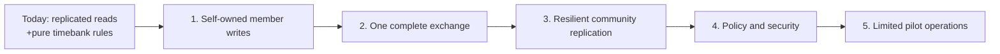
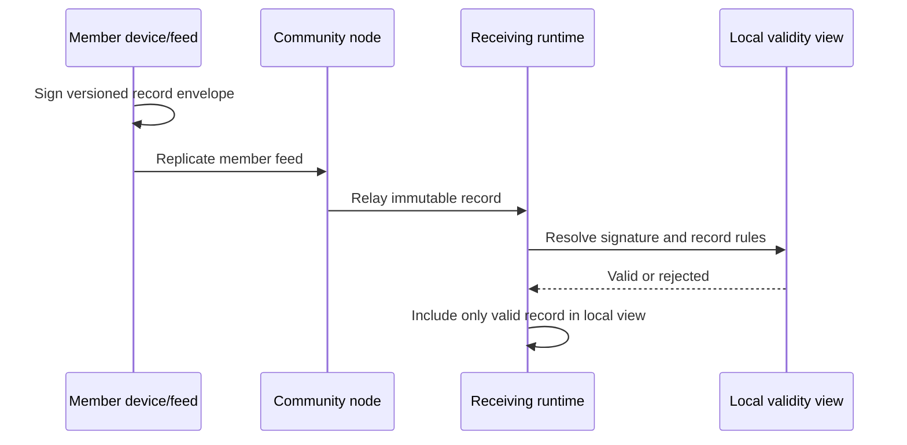

# Production roadmap

Peer Hours has working foundations for local peer storage, direct member-feed replication, always-on community peers, and pure timebank rules. It is **not** ready to operate a real timebank yet. This roadmap describes the smallest safe route from the current foundation to a limited community pilot.

It deliberately separates verified capability from proposed work. A phase is complete only when its acceptance criteria are demonstrated in automated tests and in the running applications; a diagram or package interface alone is not completion.

The roadmap preserves Peer Hours' non-governing, not-for-profit direction: a real deployment must not require a central admission service, mandatory vendor host, transaction fee, or operator with special power over member identities, records, or balances. Community peers may make the network more available, but they remain supportive infrastructure rather than a governing layer. A healthy member-desktop mesh must be able to discover, connect, and replicate without a community peer; community peers improve durability and recovery when that mesh is sparse or offline.

## What exists today

The desktop application has an embedded, persistent peer runtime. An always-on community peer has a persistent Corestore, Hyperswarm connectivity, and diagnostic status. It joins the same discovery scope and can retain/replicate known member feeds, but it does not own a canonical community history or decide which member records are valid. A separately deployable, read-only bootstrap service can publish the public discovery metadata needed by a new desktop; it is not part of the peer runtime.

The shared packages test these pure rules in memory:

- member-owned listings and accepted exchange proposals without a profile-status participation gate;
- Ed25519 attestation verification against an in-memory member-key registry;
- exact matching between one accepted proposal and one normal settlement transfer;
- immutable time-credit transfers, reversals, idempotency, and derived balances; and
- immutable record envelopes, Ed25519 member signatures over complete proposal/transfer envelopes, and deterministic resolution of compatible record histories.

These are necessary building blocks, but none makes a record network-authoritative. Each member runtime now owns a separate writable member feed, and a root-signed declaration can bind a self-certifying public identity to a feed key; direct replication of a known member feed is integration-tested. A two-runtime integration test now proves a narrow complete protocol exchange with no community peer: a deliberately direct Corestore connection carries feed declarations, signed published listings, an accepted proposal, and a dual-attested settlement, then both sides independently resolve identical balances. A second test begins with no remote feed key: the runtimes share only a discovery-core key, exchange a signed expiring announcement, and automatically open/replicate the announced feed. The resolver accepts declared root keys for member-signed records without a community authorization event, and its feed-aware API rejects a member-authored domain record supplied from a feed its author did not declare. The desktop exposes a read-only local member-feed inspector and can create a self-owned identity in the main process, encrypt its private key with operating-system-backed storage, append a root-signed feed declaration, and publish an announcement; automated desktop tests cover creation, retry, restart, unavailable storage/community scope, and corrupted persistence. Record composition and member-facing resolved balances remain absent. The community peer is an availability participant without a human member identity, not a record writer or authority.

## 1. Self-owned member writes

**Goal:** a member can create a signed record that other runtimes accept through transparent protocol rules, without membership approval or a central authority deciding who may participate.

### Proposed design direction

Use a separate append-only feed per member device, or an equivalently explicit multiwriter protocol. Each feed must have a stable public identity. Every record should carry a versioned envelope, author identity, signature, community scope, and causal/reference information needed by the resolver. The protocol must authenticate authorship without turning a community node or administrator into a membership gate. Identity, contact metadata, and user-selected trust signals need distinct records and visibility boundaries.

An always-on community peer may relay and retain member feeds, but it must not silently become a directory authority, an admission gate, or the sole actor that decides member truth.

### Acceptance criteria

- A member record survives independent process restart and replication through at least two runtimes.
- An unknown, revoked, cross-community, malformed, or tampered writer cannot affect the resolved view.
- Replaying the same record is harmless; conflicting records fail visibly and deterministically.
- No record path requires community membership approval or a central admission decision.
- Private keys stay in the desktop main process or an operating-system-backed keystore; they never enter the renderer, bootstrap response, node status API, or record payload.

## 2. One complete member exchange

**Goal:** two real members complete one narrow, understandable exchange from discovery to a replicated balance view.

Build only this vertical slice first:

1. A member creates and publishes a general offer or request without membership approval.
2. Another member proposes a fixed number of minutes and a mutually agreed privacy mode.
3. The non-creator accepts the proposal.
4. After the work occurs, both members sign the same settlement terms.
5. The application shows the transfer as pending until a defined replication acknowledgement is met, then as settled.
6. Both members derive the same resulting balances from the same valid record history.

Offline composition may create local drafts. Publishing, acceptance, and settlement must make their network state visible rather than implying completion while disconnected. The acknowledgement rule is still a product and protocol decision: it could require one durable community node, multiple independent community nodes, or another explicitly documented threshold. It must be chosen and tested before the UI says “settled.”

### Acceptance criteria

- End-to-end tests run two independent desktop-capable runtimes without community-node storage, first through an explicit direct connection and later through automatic peer discovery. Later tests add community peers as optional relay and durability infrastructure.
- The UI distinguishes draft, queued, published, awaiting the other member, pending replication, settled, and rejected states.
- A duplicated proposal or settlement cannot change the derived balance twice.
- A restart during every stage produces a recoverable, explainable state.
- The flow does not rely on a mutable server-side balance as the authority.

## 3. Resilient community replication

**Goal:** a community can remain available and recoverable when one member device or one community node is offline.

The current one-node bootstrap experience is useful for development but is not sufficient operational resilience. Add multiple independently deployed community nodes per community, persistent node identities and storage, explicit replication health, and a documented bootstrap/failover configuration. The system should show the difference between “connected to a node,” “records have replicated,” and “the chosen durability acknowledgement has been met.” The current runtime already reports an instance start time and uptime; production operations still need restart information and independent reachability evidence, without labeling a long-running runtime as healthy when replication is failing.

The proposed multi-node model is replication, not a hidden central database: each node retains the same signed histories and can be replaced from a verified backup or a healthy peer. Federation across separate communities remains future work and must never merge their ledgers merely because their nodes can connect.

### Acceptance criteria

- A member configured with two community nodes recovers from either node being unavailable.
- A new node can catch up from another node and report record/feed lag without corrupting the resolved view.
- Backup and restore are rehearsed using a fresh machine or storage directory, including verification of core keys and record history.
- Integration tests cover node restart, temporary partitions, reconnect, catch-up, and one unavailable bootstrap endpoint.
- Peer counts and replication indicators derive from real transport/state data; simulators remain visibly development-only.

## 4. Community policy and security

**Goal:** make the social and security rules explicit enough for a real community to operate safely.

Cryptographic signatures tell a runtime which key signed a record; they do not determine whether the work occurred, whether someone is safe, how debt limits should work, or how a dispute should be resolved. These rules require community policy plus software support.

Before a pilot, define and implement the minimum policy surface:

- self-owned identity lifecycle and private contact metadata;
- locally controlled filtering, optional advisory signals, and transparent safety configuration;
- the -50-hour credit boundary, deterministic concurrent-settlement behavior, and any community-pool rules;
- dispute intake, evidence visibility, compensating reversals, and moderator actions;
- listing/profile/transaction privacy, retention, export, and deletion expectations; and
- protocol and policy versioning, so a client can explain why it accepts or rejects a record.

Security work should include a threat model, dependency/update process, secret handling review, encrypted local-data and backup decisions, input and envelope limits, rate limits for public node endpoints, audit logging that avoids private content, release signing, and a desktop auto-update plan. The development-only `/dev/peers` simulated-roster route is disabled by default and requires `ENABLE_DEV_PEER_REGISTRATION=true` in both the node and simulator, but it remains unauthenticated when enabled and must stay disabled for public deployments. Bootstrap metadata also needs a trust policy: current parsing rejects unsuccessful HTTP responses and structurally validates required identity/version fields, fixed-length core keys, and HTTP(S) bootstrap URLs, but it does not authenticate a node or validate a signed manifest. The exact privacy design must follow community needs and legal advice; it should not be guessed from transport choices alone.

### Acceptance criteria

- Tests cover authorization revocation, key rotation/recovery, role boundaries, and policy-version mismatch.
- The product has a written, member-readable explanation of settlement finality, disputes, recovery, and data visibility.
- No private key or sensitive unencrypted record is exposed through diagnostics, renderer state, logs, or a default backup.
- A security review produces prioritized findings and remediation decisions before external pilot members depend on balances.

## 5. Limited pilot operations

**Goal:** support one small, consenting timebank with a known operator and a recovery path—not a broad public launch.

Select a single community, a modest member count, named community-node operators, and a clear support channel. Define what data is migrated or seeded, how members enroll, where node credentials and backups live, who can pause the service, and how a serious incident is communicated. Instrument node health, process uptime and restart frequency, storage capacity, replication lag, bootstrap success, application errors, and release adoption without turning member activity into surveillance. Process uptime is context, not proof of endpoint reachability, replicated-data freshness, or safe settlement.

Run failure drills before inviting members: lose one node, restore a backup, revoke a compromised device key, restart a member device with unsynced drafts, and correct a mistaken settlement through the approved policy. Start with a limited duration and feedback loop. Expand only after the pilot's reliability, usability, privacy, and governance findings are addressed.

### Pilot exit signals

- The complete exchange flow works for pilot members without operator database edits.
- The community can restore and verify its history from documented backups.
- Members and operators can understand connection, pending, settlement, and correction states.
- Known security and policy gaps are either closed or explicitly accepted by the pilot community with appropriate limits.

## Decisions to make before implementation commits

These are not settled by the current code and should be chosen with tests, prototypes, and community input:

| Decision | Why it gates production work |
| --- | --- |
| Member-feed versus multiwriter-log protocol | Determines authorship, replication mechanics, conflict handling, and recovery. |
| Self-owned identity/feed model | Determines how members publish and rotate keys without recreating a central admission authority. |
| Settlement acknowledgement threshold | Determines when an application may honestly call a transfer settled. |
| Concurrent-spend and credit-limit behavior | Determines how negative balances and conflicting offline activity are handled. |
| Privacy and retention model | Determines which records may replicate to which nodes and what recovery/export means. |
| Community-node operating model | Determines redundancy, cost, administration, backup ownership, and incident response. |

The next engineering milestone is Phase 1: a self-owned signed member record that replicates across independent runtimes and is deterministically accepted or rejected. Settlement UI and pilot operations should wait until that boundary is real.
