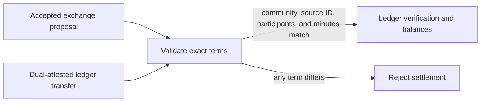

# Proposal settlement integration

`@peer-hours/timebank-settlement` is the narrow bridge between the agreement model and the ledger. It prevents an arbitrary signed transfer from being treated as the settlement for an accepted exchange merely because it names that exchange's ID.

## Current rule

Before a settlement can exist, an exchange follows two distinct immutable records:

1. The creator publishes a signed `proposed` proposal record.
2. The other participant publishes a separately signed `accepted` proposal record.

The records use distinct lifecycle-specific envelope IDs derived from the same domain proposal ID, so both can coexist in an append-only feed. When a resolver has both records, it rejects an acceptance that changes any proposed term: community, listings, participants, creator, or minutes. This preserves the creator's exact offer for the other participant to accept.

Acceptance-only histories are still read for migration compatibility. New desktop actions always publish the pending record first, and communities can make pending evidence mandatory once historical data has been migrated.

For a normal settlement, the transfer must:

- reference an accepted proposal through `sourceProposalId`;
- remain in that proposal's community;
- preserve its provider and recipient;
- preserve its exact positive whole-minute amount; and
- not be a compensating reversal.

## Settlement acknowledgement foundation

Before a desktop creates or distributes a dual-attested ledger transfer, either participant may
publish a signed settlement acknowledgement. An acknowledgement repeats the accepted proposal's
community, participant roles, proposal ID, and minutes, and its immutable record ID is derived
from that proposal ID and the acknowledging member. This makes conflicting or impersonated
acknowledgements rejectable without a central coordinator.

A resolver exposes `awaiting-counterparty` after one valid acknowledgement and
`dual-confirmed` only after both distinct proposal participants have acknowledged identical
terms. Acknowledgements do **not** produce ledger postings or change balances. The current
ledger continues to require the separate dual-attested transfer, so acknowledgement state is a
safe replicated workflow foundation rather than premature economic finality.

For a new normal-transfer publication flow, `createDualConfirmedSettlementTransfer` is the
pure composition boundary. It requires a `dual-confirmed` acknowledgement set and both
participant transfer attestations, derives a deterministic `<proposal-id>/settlement` transfer
ID, and copies every economic term from the accepted proposal. The records package exposes
`toDualConfirmedSettlementTransferRecord` to encode that result only when the envelope author is
one of the transfer participants. Cryptographic verification and durable replication are still
separate checks: composition or record encoding must never be displayed as final settlement.

Signature verification remains the responsibility of `@peer-hours/timebank-identity`; balance derivation and duplicate-settlement protection remain the responsibility of `@peer-hours/timebank-ledger`.

## Deliberate boundary

The pure package can also be used in memory, but the feed-aware records resolver now proves the supplied accepted proposal from replicated member-feed history before it locally admits a normal transfer. It resolves root-signed device-key lifecycle records, pending/accepted proposal linkage, acknowledgements, participant attestations, and the transfer together. That is still a local conclusion rather than a network-finality claim.
