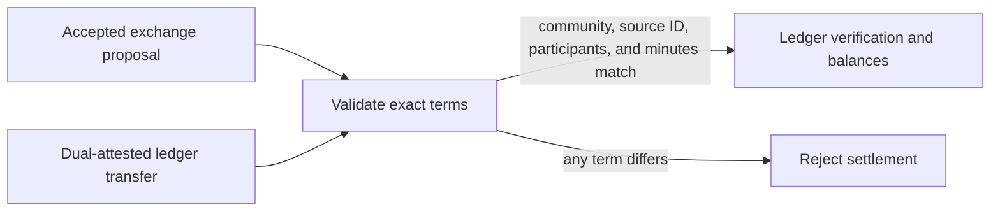

# Proposal settlement integration

`@peer-hours/timebank-settlement` is the narrow bridge between the agreement model and the ledger. It prevents an arbitrary signed transfer from being treated as the settlement for an accepted exchange merely because it names that exchange's ID.

## Current rule

For a normal settlement, the transfer must:

- reference an accepted proposal through `sourceProposalId`;
- remain in that proposal's community;
- preserve its provider and recipient;
- preserve its exact positive whole-minute amount; and
- not be a compensating reversal.

Signature verification remains the responsibility of `@peer-hours/timebank-identity`; balance derivation and duplicate-settlement protection remain the responsibility of `@peer-hours/timebank-ledger`.

## Deliberate boundary

This package works with in-memory records. It does not yet prove that the supplied accepted proposal came from replicated community history. The next network integration must replicate proposals, member-key authorization events, and transfers together; a receiving runtime will then resolve the proposal by ID before applying this validation.
