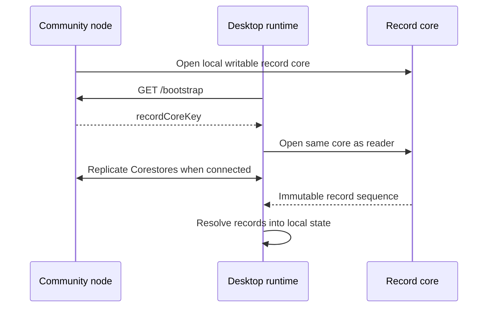

# Record-core replication

Peer Hours now has a concrete, append-only record-core foundation. A community node owns a named Hypercore for immutable JSON records, publishes its public key through `/bootstrap`, and exposes a read-only `/records` inspection endpoint. A runtime that knows that public key can open the same core and receive records when its Corestore replicates with the community runtime.



## What is implemented

- `@peer-hours/peer-runtime` exposes a generic `HypercoreRecordStore` and includes record-core metadata in its status snapshot.
- A community node publishes `recordCoreKey` in bootstrap metadata and serves current record-core status and immutable records at `GET /records`.
- A desktop runtime that fetches bootstrap metadata opens the community record core as a reader.
- Two independent runtimes are tested with a direct Corestore replication stream: records appended by the first are read as frozen, equivalent JSON values by the second.
- `@peer-hours/timebank-records` resolves compatible record histories into key authorizations, accepted proposals, verified transfers, and derived balances.

## Current operational boundary

The community node's record core is the only writable core in this first slice. Desktop runtimes open the community core for reading; they do not yet append a member's offer, proposal, key event, or transfer. This is intentional:

- a shared writable Hypercore needs an explicit multiwriter or per-member-feed protocol;
- receiving a well-formed record is not yet proof of the future self-owned identity/feed relationship that will establish authorship without membership approval; and
- timebank member workflows must not claim settlement is final until that protocol verifies and replicates it.

The resolver verifies member signatures over complete proposal and transfer envelopes, and it currently applies two distinct authorship checks: an accepted proposal must be authored by the member who accepted it; a transfer may be authored by either transfer participant. A transfer still needs the ledger's two participant attestations—its envelope author is only the record submitter, not a proxy for the other participant's consent.

The next write-path design should use independently owned member feeds or a properly defined multiwriter log and an authority policy for membership/key lifecycle events. It must carry these signed envelopes through a real member-feed replication protocol. It should preserve the existing pure resolver rather than placing validation rules in the desktop UI or node HTTP API.

## Development inspection

After starting the local community node, inspect its published record core:

```sh
curl http://127.0.0.1:10000/bootstrap
curl http://127.0.0.1:10000/records
```

The desktop Network workspace displays the active record core, whether it is local or supplied by a community node, and the number of records currently available locally.
