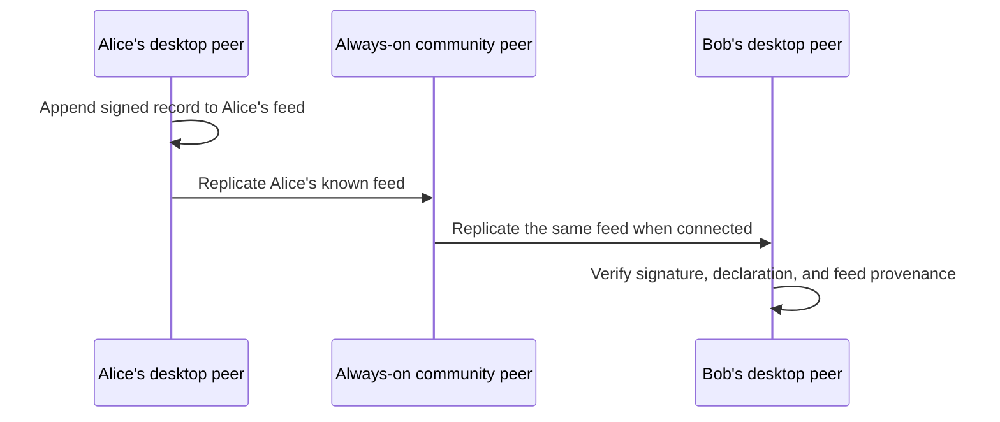

# Member-feed replication

Peer Hours replicates **member-owned feeds**, not a canonical community record core. Every desktop runtime and always-on community node is a peer with local storage. A community node stays online to improve discovery and availability; it does not own, approve, or author the community's timebank history.

## Current implementation

- Each `PeerRuntime` owns a persistent `peer-hours-member-records` Hypercore feed.
- The feed survives runtime restart and can replicate directly to another runtime that knows its public key.
- A self-owned root identity signs a declaration binding its member ID to a community-scoped feed key.
- `resolveTimebankMemberFeeds()` accepts records grouped by source feed and rejects a published listing, proposal, or transfer arriving through a feed its author did not declare.
- An integration test runs two isolated member runtimes with no community peer or bootstrap endpoint. It wires their Corestores together directly, then replicates root-signed feed declarations, signed published listings, an accepted proposal, and a dual-attested settlement; both sides independently derive the same balances. This proves the record path does not require a community peer, not that automatic member discovery is complete.
- The community node exposes bootstrap, health, and status diagnostics only. It has no `/records` endpoint and no record-writing API.

## What discovery still needs

A runtime must currently know a member-feed key before it can open and replicate that feed. The next protocol layer is a privacy-aware peer announcement mechanism: peers exchange public feed declarations after connecting through the community discovery topic. An always-on community peer can retain and relay those announcements, but must apply the same validation as every other peer and must never decide who is allowed to announce.

The member feed is the source of an author's signed records. A community node being online does not make a record valid, final, or authoritative; validity remains a local conclusion derived from signatures, source-feed provenance, agreement rules, and ledger rules.

The verified test is a protocol vertical slice, not yet a desktop feature. The desktop UI still needs identity setup, feed discovery, listing composition, proposal/settlement screens, and clear pending/settled states before a member can perform this flow through the application.
