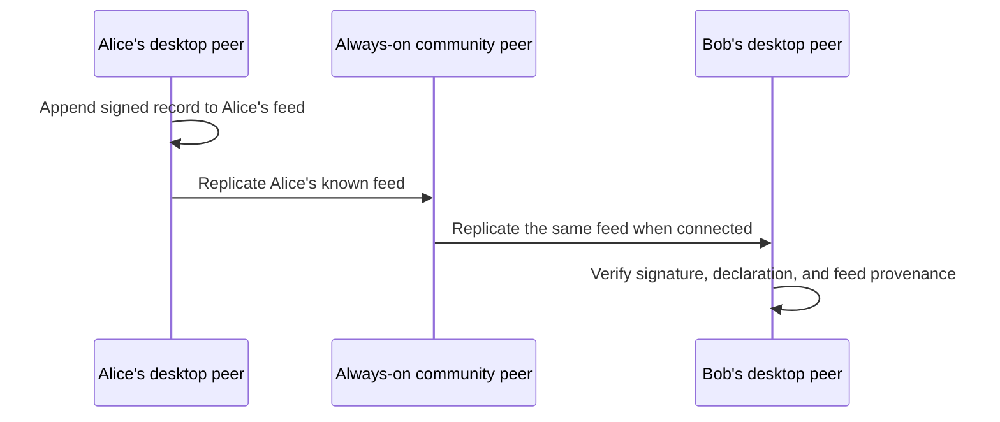

# Member-feed replication

Peer Hours replicates **member-owned feeds**, not a canonical community record core. Every desktop runtime and always-on community node is a peer with local storage. A community node stays online to improve discovery and availability; it does not own, approve, or author the community's timebank history.

## Current implementation

- Each `PeerRuntime` owns a persistent `peer-hours-member-records` Hypercore feed.
- The feed survives runtime restart and can replicate directly to another runtime that knows its public key.
- A self-owned root identity signs a declaration binding its member ID to a community-scoped feed key.
- `resolveTimebankMemberFeeds()` accepts records grouped by source feed and rejects a published listing, proposal, or transfer arriving through a feed its author did not declare.
- A root-signed, expiring feed announcement can be exchanged over the shared discovery core. A receiving runtime validates it, opens the named feed automatically, and Corestore adds that feed to the existing replication connection.
- An integration test runs two isolated member runtimes with no community peer or bootstrap endpoint. It wires their Corestores together directly, then replicates root-signed feed declarations, signed published listings, an accepted proposal, and a dual-attested settlement; both sides independently derive the same balances. A second integration test starts with no remote feed key, exchanges a signed announcement over a shared discovery-core key, and automatically replicates the newly discovered feed without a community-peer process.
- The community peer exposes health and status diagnostics only. A separate minimal bootstrap service exposes discovery metadata at `/bootstrap`; neither process has a `/records` endpoint or a record-writing API.

## What discovery still needs

A runtime still needs a shared discovery-core key, obtained from a bootstrap manifest, invitation, or future local configuration, before it can meet compatible peers. Once connected on that scope, members exchange root-signed announcements carrying only the declared feed identity and a short expiry; no email, address, or private profile data belongs in the announcement. An always-on community peer can cache and relay valid announcements to peers that arrive later, but must apply the same validation as every other peer and must never decide who is allowed to announce.

The member feed is the source of an author's signed records. A community node being online does not make a record valid, final, or authoritative; validity remains a local conclusion derived from signatures, source-feed provenance, agreement rules, and ledger rules.

The verified tests are protocol vertical slices, not yet complete desktop features. The desktop can create a self-owned root identity in its main process, encrypt the private key with operating-system-backed storage, append a root-signed declaration to its local feed, and publish an announcement. The desktop UI still needs listing composition, proposal/settlement screens, and clear pending/settled states before a member can perform this flow through the application.
