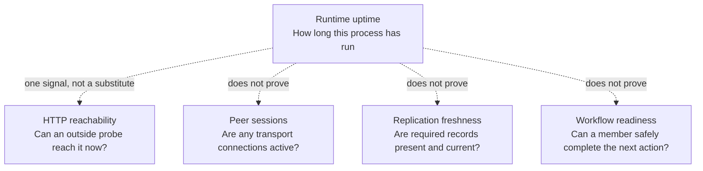

# Runtime uptime and observability

Community nodes make data more available, but an operator needs more than a green light to understand whether a node is useful to the community. This note separates the current **runtime uptime** signal from the other facts Peer Hours must report.

## Current, verified signals

The current community-node HTTP API exposes two diagnostic views:

- `GET /health` returns `200` with `status: "ok"` only while the embedded runtime reports `online`; before storage is ready or after a startup error it returns `503` with the runtime state instead. It also returns the current network-core key and length. Responses are explicitly non-cacheable, so probes do not report an earlier healthy observation as current.
- `GET /status` returns the runtime's current snapshot: runtime state, `startedAt`, non-negative `uptimeMs`, whether Hyperswarm is listening, discovery counters, peer lifecycle entries, network-core information, record-core metadata, bootstrap state, and any current error.

When a runtime is configured with bootstrap endpoints, its status also reports the endpoint that last supplied compatible metadata, the ordered configured or manifest-advertised alternatives, the most recent successful fetch time, consecutive all-endpoint failures, and the last fetch error. The runtime tries the last successful endpoint first, then alternatives, at startup and on a 30-second refresh. A manifest that changes an already selected community ID or discovery-core key is rejected rather than silently moving the local runtime to another scope.

These endpoints are useful for local development and for a basic platform health check. `startedAt` is captured when the current `PeerRuntime` instance is constructed, and `uptimeMs` is derived from that runtime's clock; uptime is clamped at zero if that clock moves backwards. A successful response still describes a point-in-time observation, not proof that the node has been continuously available. The node also exposes a read-only `GET /receipts/:transferId` route when configured with its durable receipt identity. It issues a signed retention receipt only after locally resolving and retaining the named transfer; that receipt is availability evidence and not a validity or finality decision.

The new bootstrap observations make endpoint failure visible; they do not make bootstrap metadata authenticated, establish community trust, or prove that any node has caught up with every known feed. A community must choose and document its own freshness target, independent backup evidence, and restore objective before interpreting these fields as operational readiness.

At process startup, the community node validates `PORT` as an integer from 1 through 65535, resolves `DATA_DIR` to an absolute path, rejects blank or whitespace-padded `DATA_DIR` values, validates an optional `PEER_HOURS_BOOTSTRAP_KEY` as a 64-character hexadecimal Hypercore key, and accepts `ENABLE_DEV_PEER_REGISTRATION` only as the explicit values `true` or `false`. These checks happen before the runtime opens durable storage. The runtime creates the selected directory, but operators should mount it on durable storage and make it writable by the service account. Development peer registration remains off unless explicitly enabled and must not be enabled on a public deployment. On `SIGINT` or `SIGTERM`, the process stops accepting HTTP connections before it closes the peer runtime's swarm and local store; repeated signals share the same shutdown operation rather than racing storage closure.

When a runtime obtains bootstrap metadata or a community-node roster over HTTP, it treats those responses as untrusted operational input: it accepts only bounded HTTP(S) URLs without embedded credentials or fragments, requires a successful JSON response, bounds JSON responses to 64 KiB, applies a 10-second request timeout, and validates the implemented manifest version and peer-roster fields before updating local status. Manifests may name at most 16 fallback endpoints and a diagnostics roster may contain at most 256 peers. Roster peer identifiers are bounded and unique, and timestamps must be canonical ISO instants, so an ambiguous diagnostics response cannot silently overwrite or multiply a peer observation. A failed optional diagnostics refresh clears the remote roster rather than retaining a stale claim about the community node. These checks make the view safer and more predictable; they do not authenticate the endpoint or make bootstrap metadata authoritative.

`PeerRuntime.start()` does not report completion until its local store has opened and, when networking is enabled, Hyperswarm has begun listening. A listen failure therefore fails startup and triggers the same storage cleanup path as another startup failure rather than becoming a detached background rejection. Status snapshots are detached and frozen before listeners receive them; an observer cannot mutate a runtime's internal peer state, and one failing observer is isolated from the remaining listeners and lifecycle work. These are process-safety properties, not evidence that another peer has replicated data.

The node and bootstrap HTTP services interpret routes by pathname, not by the complete request target, discard unexpected request bodies, bound request, header, and keep-alive timeouts, limit headers and requests per connection, and close malformed parser-level HTTP with a fixed response that does not reflect request content. They return JSON with `nosniff`, `no-referrer`, clickjacking protection, a deny-all content-security policy, and explicit cache policy headers. The community node keeps diagnostics non-cacheable. Bootstrap metadata alone may be cached briefly (`max-age=60`); it is static convenience metadata, never a member or ledger response. Neither service adds a write surface as part of these operational endpoints.

## What runtime uptime would mean

The current runtime uptime answers one narrow question:

> How long has this particular `PeerRuntime` instance existed according to its local clock?

It is emitted as a readable start time and millisecond duration:

```json
{
  "startedAt": "2026-07-18T14:20:00.000Z",
  "uptimeMs": 1842000
}
```

This is runtime diagnostic data, not a protocol field and not an imagined lifetime of the community or its record history. It resets when a new runtime instance is constructed; because it begins before asynchronous startup completes, it does not itself prove that startup succeeded. A future operator-facing view may add a restart counter, deployment version, and external probe history.



## What uptime does not show

A high uptime value is encouraging, but it does **not** demonstrate any of the following:

- A hosting provider has been reachable from the public internet. That needs independent external probes and historical success/failure data.
- The node is listening for peers or has an active Hyperswarm connection.
- Every required member feed has replicated all required blocks, is fresh, or agrees with another peer.
- Bootstrap metadata is trusted. The current bootstrap parser validates structure, including optional receipt-node metadata, not community authority. A client must compare a receipt to a member-installed expected node identity before treating it as durability evidence.
- A record is authorized, settled, private, backed up, or recoverable.
- A member's exchange is replicated to another peer, acknowledged by a counterparty, or treated as socially final. The desktop can compose and publish its local workflow records; peer delivery, counterparty action, and the limits of local ledger admission remain separate operational facts.

For example, a node can show seven days of uptime while having zero peers, while its upstream bootstrap configuration is wrong, or while it has not received a new record for days. Conversely, a freshly restarted node can have low uptime while correctly serving a complete local record history.

## Future operational picture

Production observability should present independent signals together rather than reducing them to one “healthy” label:

| Question | Evidence needed | Current state |
| --- | --- | --- |
| How long has this runtime instance existed? | `startedAt`, `uptimeMs` | Available in `/status` |
| Is the deployed service continuously available? | restart count, deployment context, independent probe history | Proposed |
| Can users reach the HTTP endpoint? | independent HTTPS probe history | Proposed |
| Can the runtime join the peer network? | listening state, discovery counters, live peer sessions | Partly available in `/status` |
| Is replicated data current enough? | record-core length, known-peer comparison, lag/freshness policy | Record length is available; freshness policy is future work |
| Can the timebank safely operate? | authorization, settlement acknowledgement, storage/backup, policy checks | Future work |

Monitoring should favor operational facts over member surveillance. It can report node availability, storage capacity, restart frequency, endpoint success, replication lag, and application errors without collecting the content of member records or turning participation patterns into a tracking system.

See [network architecture](network-architecture.md#first-useful-prototype) for the broader connection-status model and the [production roadmap](production-roadmap.md#3-resilient-community-replication) for the operational milestones that must follow.
