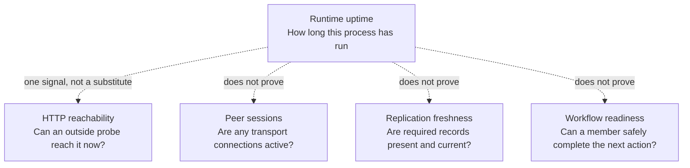

# Runtime uptime and observability

Community nodes make data more available, but an operator needs more than a green light to understand whether a node is useful to the community. This note separates the current **runtime uptime** signal from the other facts Peer Hours must report.

## Current, verified signals

The current community-node HTTP API exposes two diagnostic views:

- `GET /health` returns `200` with `status: "ok"` only while the embedded runtime reports `online`; it also returns the current network-core key and length.
- `GET /status` returns the runtime's current snapshot: runtime state, `startedAt`, non-negative `uptimeMs`, whether Hyperswarm is listening, discovery counters, peer lifecycle entries, network-core information, record-core metadata, bootstrap state, and any current error.

These endpoints are useful for local development and for a basic platform health check. `startedAt` is captured when the current `PeerRuntime` instance is constructed, and `uptimeMs` is derived from that runtime's clock; uptime is clamped at zero if that clock moves backwards. A successful response still describes a point-in-time observation, not proof that the node has been continuously available.

## What runtime uptime would mean

The current runtime uptime answers one narrow question:

> How long has this particular `PeerRuntime` instance existed according to its local clock?

It is emitted as a readable start time and millisecond duration:

```json
{
  "startedAt": "2026-07-18T14:20:00.000Z",
  "uptimeMs": 1842000
}
```

This is runtime diagnostic data, not a protocol field and not an imagined lifetime of the community or its record history. It resets when a new runtime instance is constructed; because it begins before asynchronous startup completes, it does not itself prove that startup succeeded. A future operator-facing view may add a restart counter, deployment version, and external probe history.



## What uptime does not show

A high uptime value is encouraging, but it does **not** demonstrate any of the following:

- A hosting provider has been reachable from the public internet. That needs independent external probes and historical success/failure data.
- The node is listening for peers or has an active Hyperswarm connection.
- The community record core has replicated all required blocks, is fresh, or agrees with another node.
- Bootstrap metadata is trusted. The current bootstrap parser validates structure, not community authority.
- A record is authorized, settled, private, backed up, or recoverable.
- A member can complete an offer, proposal, or settlement workflow. That workflow is not yet wired to a production write path.

For example, a node can show seven days of uptime while having zero peers, while its upstream bootstrap configuration is wrong, or while it has not received a new record for days. Conversely, a freshly restarted node can have low uptime while correctly serving a complete local record history.

## Future operational picture

Production observability should present independent signals together rather than reducing them to one “healthy” label:

| Question | Evidence needed | Current state |
| --- | --- | --- |
| How long has this runtime instance existed? | `startedAt`, `uptimeMs` | Available in `/status` |
| Is the deployed service continuously available? | restart count, deployment context, independent probe history | Proposed |
| Can users reach the HTTP endpoint? | independent HTTPS probe history | Proposed |
| Can the runtime join the peer network? | listening state, discovery counters, live peer sessions | Partly available in `/status` |
| Is replicated data current enough? | record-core length, known-peer comparison, lag/freshness policy | Record length is available; freshness policy is future work |
| Can the timebank safely operate? | authorization, settlement acknowledgement, storage/backup, policy checks | Future work |

Monitoring should favor operational facts over member surveillance. It can report node availability, storage capacity, restart frequency, endpoint success, replication lag, and application errors without collecting the content of member records or turning participation patterns into a tracking system.

See [network architecture](network-architecture.md#first-useful-prototype) for the broader connection-status model and the [production roadmap](production-roadmap.md#3-resilient-community-replication) for the operational milestones that must follow.
