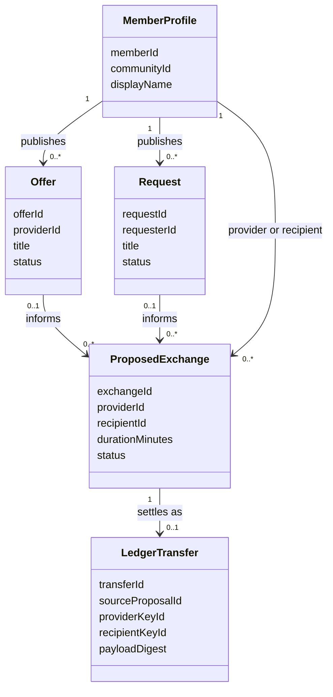

# First timebank domain model

This is a working model for the first Peer Hours exchange workflow. It gives the product a shared vocabulary and a small set of rules that can be tested before transport, storage, or interface work is added. Peer Hours has decided on open participation rather than membership approval; profiles identify ownership within a community but do not determine whether someone may participate. See [open participation and agreement privacy](open-participation-and-agreement-privacy.md).

## Boundary

All records belong to exactly one `communityId`. One underlying person identity is intended to participate across communities, while profiles, listings, and exchanges remain community-specific. The current model does not yet represent that cross-community root identity. Records use stable identifiers and timestamps; duration is stored as whole minutes, never a floating-point number of hours.

An offer or request may be composed while offline. Settlement is different: it requires both participants' consent and must be replicated before the application presents it as final. A verified ledger transfer is the source for derived balances; it does not itself mutate a stored balance.



## Records and invariants

### Member profile

A member profile represents a member's public presence within one community. It contains `memberId`, `communityId`, `displayName`, and eventually carefully separated public and private metadata. It is not a membership approval, account state, or suppression mechanism.

- `memberId` and `communityId` are immutable after creation.
- `displayName` is required and non-blank.
- A profile is not a device identity or a signing key. Those bindings belong to the separate [identity attestation boundary](identity-attestations.md).

### Offer

An offer is a provider's listing of help they are willing to give. It contains `offerId`, `communityId`, `providerId`, `title`, optional description and availability, `status`, and timestamps. Its initial status is `draft`; it may become `published`, `paused`, `withdrawn`, or `fulfilled`.

- The provider profile must match the offer owner in the same community.
- Only the provider may edit, pause, withdraw, or mark their offer fulfilled.
- A published offer must have a non-blank title.
- An offer may inform a proposal but does not reserve a provider or create a credit obligation.

### Request

A request is a member's listing of help they seek. It contains `requestId`, `communityId`, `requesterId`, `title`, optional description and timing needs, `status`, and timestamps. Its lifecycle matches an offer: `draft`, `published`, `paused`, `withdrawn`, or `fulfilled`.

- The requester profile must match the request owner in the same community.
- Only the requester may edit, pause, withdraw, or mark their request fulfilled.
- A published request must have a non-blank title.
- A request may inform a proposal but does not create an obligation to accept help.

### Proposed exchange

A proposed exchange is a specific agreement-in-progress between a provider and a recipient. It contains `exchangeId`, `communityId`, `providerId`, `recipientId`, `durationMinutes`, optional offer and request references, a human-readable summary, `status`, timestamps, and participant acknowledgements. It begins as `proposed`, and may become `accepted`, `declined`, `cancelled`, or `expired`.

- Provider and recipient must be distinct, matching owners in the same community.
- `durationMinutes` is a positive whole number.
- Referenced offer and request records, when present, must belong to the same community and match the relevant participant.
- A proposal cannot be edited after either participant has accepted it; create a new proposal instead.
- Only the non-creator can accept a proposal. Either participant can decline or cancel it before completion.
- Acceptance records the accepting member and timestamp. It is a commitment to the proposed terms, not evidence that the service occurred.
- **Implemented resolver rule:** the signed accepted-proposal envelope must be authored by the accepting member. This authenticates who performed the acceptance; it is separate from the two attestations required later for settlement.

### Settlement transfer

A settlement transfer is the final, signed account of an exchange that took place. It references one accepted proposal and preserves its community, provider, recipient, duration, and eventually its mutually agreed privacy mode. Each participant attestation names the authorized signing `keyId`, carries a SHA-256 digest of the canonical transfer bytes, and carries an Ed25519 signature. The transfer is immutable.

- It can be created only from one accepted proposal and only once for that proposal.
- Both signatures must authenticate the exact same canonical transfer bytes.
- The provider receives `minutes` of time credit; the recipient incurs the corresponding debit when the ledger derives balances.
- A transfer with missing, invalid, mismatched-key, or mismatched-digest attestations is invalid.
- **Implemented resolver rule:** the replicated transfer envelope may be authored by either the provider or recipient, but the ledger still requires attestations from both participants. Envelope authorship identifies who submitted that immutable record; it does not replace either participant's settlement consent.
- **Product decision, not implemented:** agreements default to `private-details`; either participant may choose `community-visible`, but both must accept the same privacy mode. Fully confidential transfers are future protocol work.
- **Implemented ledger rule, not yet integrated end-to-end:** the default minimum recipient balance is -50 hours (`-3000` minutes). An over-limit ordinary settlement is rejected from the derived ledger; it does not remove a person from the network.
- **Proposed network rule:** a locally signed transfer should remain pending until its configured replication acknowledgement is recorded; it must not be presented as finalized beforehand. No acknowledgement or finalization protocol is implemented yet.
- Corrections are compensating transfers, never edits to a settled transfer.

The current `@peer-hours/timebank-ledger` and `@peer-hours/timebank-identity` packages implement the transfer and verification rules in memory. The current record resolver also enforces that an accepted-proposal envelope is authored by its accepting member, and that a transfer envelope is authored by one of its two participants. Replicated authorization records and a real member-feed submission protocol remain future integration work.

## TDD acceptance scenarios

These scenarios are intentionally phrased at the domain boundary. The first implementation should make them pass in a pure in-memory test suite before adapting them to signed events and replicated storage.

### Profile and listing eligibility

```gherkin
Scenario: A member publishes their own offer
  Given a member profile in East Bay Timebank
  And that member has a draft offer titled "Garden help"
  When the member publishes the offer
  Then the offer status is "published"

Scenario: A member cannot publish another person's request
  Given a member has a draft request titled "Ride to a medical appointment"
  When another member tries to publish the request
  Then the operation is rejected
  And the request remains a draft
```

### Proposal validity and consent

```gherkin
Scenario: A provider proposes an exchange from a published request
  Given a provider and recipient in the same community
  And the recipient has a published request
  When the provider proposes 90 minutes of help for that request
  Then the proposal is "proposed"
  And its provider, recipient, request, and community are recorded

Scenario: A member cannot propose an exchange with themself
  Given a member in a community
  When the member proposes a 60 minute exchange as both provider and recipient
  Then the operation is rejected

Scenario: Acceptance freezes the agreed terms
  Given a proposed 60 minute exchange
  When the recipient accepts it
  Then the proposal is "accepted"
  And changing its duration or participants is rejected
```

### Completion and accounting boundary

```gherkin
Scenario: Both participants settle an accepted exchange
  Given an accepted 60 minute exchange between a provider and recipient
  When both participants sign the same canonical transfer payload
  And replication acknowledgement is recorded
  Then one immutable settlement transfer exists
  And it is finalized
  And it credits the provider 60 minutes and debits the recipient 60 minutes through balance derivation

Scenario: A single signature cannot finalize an exchange
  Given an accepted exchange signed only by the provider
  When settlement is requested
  Then no finalized settlement transfer exists
  And the transfer remains pending or is rejected

Scenario: A settlement cannot be duplicated
  Given a finalized settlement transfer for an accepted proposal
  When either participant attempts a second settlement for that proposal
  Then the operation is rejected
```

## First implementation slice

Start with pure functions and immutable records for profile ownership, offer/request publication, proposal creation, acceptance, and rejection. Write the scenarios above as failing tests first. Add signing, persistence, replication acknowledgement, and derived balances only after the in-memory state transitions are proven. This creates a concrete reuse case for a domain package without prematurely deciding its npm name or its transport format.

The current implementation is [`@peer-hours/timebank-domain`](../packages/timebank-domain/). It covers community-scoped profiles, draft/published listings, and proposed/accepted exchanges. It stores positive whole `minutes`, preserves the owning `communityId`, requires matching listing owners and proposal participants, and records both the proposal creator and accepting participant. It rejects self-matches, cross-community matches, unpublished listings, mismatched members, and proposals larger than either listing. An accepted proposal does not move any time credit. The separate ledger and identity packages now cover in-memory transfer attestation and balance derivation; network replication and proposal-to-transfer integration remain future slices.

The next settlement boundary is documented in [ledger settlement](ledger-settlement.md). It is deliberately a separate package so that accepting an exchange and moving time-credit balances cannot be conflated.

## Questions left open

- How will the -50-hour boundary and transfer-ID ordering be surfaced when concurrent offline settlements compete?
- How will mutual email-exchange consent and `private-details` encryption be represented without public replication of contact data?
- How long can a proposal remain open before it expires?
- Which general profile and listing fields are community-visible, and how will desktop-local filters compose with optional advisory signals?
- How do disputes produce compensating events without rewriting history?
