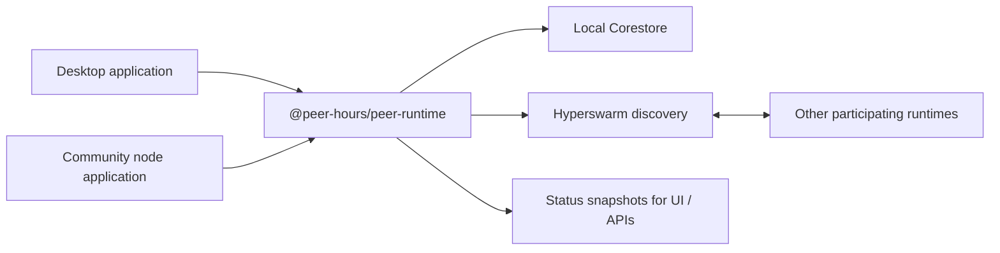

# @peer-hours/peer-runtime

`@peer-hours/peer-runtime` is the local networking runtime used by a Peer Hours application or community node. It creates a persistent Corestore, joins Hypercore discovery topics through Hyperswarm, replicates its store across incoming connections, and exposes a serializable status snapshot for a UI or HTTP API.

It is an internal workspace package today (`private: true`), not a published npm package.

## Role in Peer Hours

This package is the network-facing foundation beneath the desktop application's embedded runtime and the headless community-node application. It does not decide what a timebank exchange means; it makes a local runtime available, connected, and observable.



The package is deliberately separate from the timebank-domain and ledger packages: those packages express and validate business records, while this package currently provides connection and replication plumbing.

## Current responsibilities

- Creates an app-owned local data directory and Corestore.
- Opens the `peer-hours-network` Hypercore and joins its discovery key.
- Starts a Hyperswarm instance, listens for connections, and replicates the local Corestore over them.
- Optionally obtains a community manifest from a configured bootstrap URL or uses a supplied bootstrap-core key, then joins that core's discovery key.
- Tracks direct Hyperswarm connections and derives `connecting`, `connected`, `stale`, and `offline` lifecycle states from peer freshness.
- Polls a configured community node's `/status` endpoint to include its reported peer roster in the status view.
- Supports explicitly registered simulated peers for development-only topology and UI testing. A simulated status entry is not proof of a direct transport connection or replication.
- Provides `HypercoreRecordStore`, a generic append/read wrapper for immutable JSON records in a named Hypercore.
- Emits status changes through `onStatusChange()` and provides snapshots through `status()`.

## Explicit non-responsibilities

- It does not define, persist, or validate timebank members, listings, exchange proposals, transfers, balances, or signatures.
- It does not interpret or validate timebank-domain, identity, or ledger records. It can replicate their immutable JSON envelopes through a shared record core, while `@peer-hours/timebank-records` owns their meaning and resolution.
- It does not authenticate a bootstrap endpoint, establish that a fetched community manifest is trustworthy, or authorize community membership. The current loader checks a successful HTTP response and validates a complete manifest: a JSON object with nonblank community ID/display name, a positive integer protocol version, 64-character hexadecimal core keys, and HTTP(S) bootstrap URLs. It normalizes accepted keys and URLs. It does not yet pin a key, verify a signature, or establish that the endpoint is an authorized community operator.
- It does not guarantee that a peer shown from a community node's status endpoint is a direct local connection.
- It is not an HTTP server; applications such as `apps/node` decide which endpoints to expose.
- Simulated-peer registration is a status fixture only; it is not a real Hyperswarm connection or replication participant. A simulator process may run its own runtime, but registering its ID with a node does not prove that runtime is connected or synchronized.

## Public API and concepts

### `PeerRuntime`

`PeerRuntime` owns one local networking lifecycle:

```ts
const runtime = new PeerRuntime(
  "/path/to/app-data",
  undefined,
  "http://127.0.0.1:10000/bootstrap",
);

await runtime.start();
const status = runtime.status();
await runtime.stop();
```

Its constructor accepts an application-owned data directory, an optional bootstrap core key (hex), an optional bootstrap URL, an optional clock useful for deterministic tests, and an optional community record-core key. The final networking flag is intended for deterministic storage tests; application runtimes use the default enabled networking. `start()` initializes storage and discovery; `stop()` closes the swarm and store.

### Status

`status()` returns `LocalPeerStatus`, a serializable snapshot containing:

- local runtime state (`starting`, `online`, or `error`);
- the local peer/core ID and replication core length;
- listening and Hyperswarm discovery counts;
- direct and community-reported `PeerStatus` entries;
- bootstrap fetch state and optional `CommunityManifest` metadata.
- active record-core key, local record count, and whether that core is locally owned or supplied by a community node.

`onStatusChange(listener)` subscribes to meaningful status changes and returns an unsubscribe function.

### Generic record storage

`HypercoreRecordStore` persists immutable JSON values in one named Hypercore and can open a remote reader using that core's public key. `writable` reports whether the local Corestore owns the private writer key, and `append()` rejects remote reader cores. This prevents a desktop that opened a community-owned record core from being mistaken for an authorized writer. The store owns no record vocabulary; `@peer-hours/timebank-records` defines the Peer Hours record envelope and resolver that an application may store in it.

### Peer lifecycle

`derivePeerLifecycleState(peer, now?, staleAfterMs?, offlineAfterMs?)` applies the current freshness policy. A connected peer becomes `stale` after 10 seconds without being seen and `offline` after 30 seconds. Explicitly offline peers remain offline. These thresholds are implementation details of the current runtime, not a protocol guarantee.

### Community manifest

`CommunityManifest` is the bootstrap metadata currently read from an endpoint. It includes a community ID, display name, protocol version, public network core key, optional `recordCoreKey`, and bootstrap-node URLs. The runtime uses `coreKey` to open and join the associated discovery core and opens `recordCoreKey` as a reader when present.

This is structural validation, not trust establishment. Callers should surface bootstrap errors and avoid presenting fetched metadata as authenticated community authority until the protocol adds a signed or pinned manifest policy.

## Dependencies

- [`corestore`](https://github.com/holepunchto/corestore) for local Hypercore storage and replication.
- [`hyperswarm`](https://github.com/holepunchto/hyperswarm) for discovery and encrypted peer connections.
- Node.js built-in HTTP/HTTPS clients for fetching bootstrap and community-node status JSON.

## Validation

Run this package's focused checks from the repository root:

```sh
npm --workspace @peer-hours/peer-runtime test
npm --workspace @peer-hours/peer-runtime run typecheck
npm --workspace @peer-hours/peer-runtime run build
```
