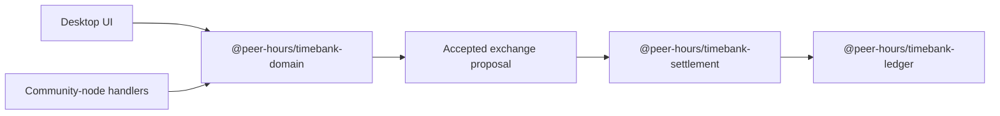

# @peer-hours/timebank-domain

`@peer-hours/timebank-domain` is the pure rule layer for the early Peer Hours timebank workflow. It creates community-scoped member profiles and service listings, then validates the creation and acceptance of an exchange proposal.

It is an internal workspace package today (`private: true`), not a published npm package.

## Role in Peer Hours

This package gives every application and later replicated protocol code the same answer to questions such as “may this listing be published?” and “may this proposal be accepted?” It contains no UI, storage, networking, or cryptography, so those rules can be tested and reused without a running peer or community node.



An accepted proposal is an agreement to exchange time, not a completed or settled transfer. The settlement and ledger packages own the later validation and accounting boundaries.

## Current responsibilities

- Creates a `MemberProfile` with a required ID, community ID, display name, and active/inactive status.
- Creates member-owned offer and request listings as drafts.
- Requires a listing's active owner in the same community to publish that draft.
- Validates that an exchange matches one published offer and one published request in the same community.
- Requires active profiles matching the offer and request owners.
- Rejects self-exchanges and proposals whose minutes are not positive whole numbers or do not fit within both listings.
- Requires the proposal creator to be one of the two participants.
- Allows only the other participant to accept a still-proposed, still-valid exchange.
- Throws `DomainRuleError` when an explicit rule is violated.

## Explicit non-responsibilities

- It does not persist, replicate, discover, or synchronize any record.
- It does not authenticate members or verify signatures, keys, or key authorizations.
- It does not calculate balances, create ledger postings, settle an accepted proposal, or prevent settlement duplication.
- It does not implement listing search, availability scheduling, partial completion, cancellation, closing, editing, or deletion workflows beyond the current draft/published/closed types.
- It does not enforce globally unique identifiers; callers supply record IDs.
- It does not determine whether a member profile is authoritative or currently replicated from the community.

## Public API and concepts

### Members

`MemberProfile` is a member identity scoped to one `communityId`. Use `createMemberProfile()` to validate and create it. The default status is `active`; inactive profiles cannot publish a listing, create a valid proposal participant set, or accept a proposal.

### Listings

`createOffer()` and `createRequest()` create `Listing` records in `draft` status. A listing has an owner, title, and positive whole-minute capacity. `publishListing()` returns a copy in `published` status after checking the supplied owner is active and matches the listing's member and community.

`ListingStatus` also includes `closed` for representing lifecycle state, but this package does not currently export an operation that closes a listing.

### Exchange proposals

`proposeExchange()` creates an `ExchangeProposal` in `proposed` status from a published offer, published request, matching active participant profiles, a participant creator ID, and a valid minute amount.

`acceptExchangeProposal()` returns a new proposal in `accepted` status with `acceptedByMemberId`. It revalidates the supplied proposal, listings, and profiles, and permits acceptance only by the participant who did not create the proposal.

### Errors

`DomainRuleError` is the package's explicit rule-violation error. Callers can use it to distinguish invalid domain actions from operational failures such as storage or network errors.

## Dependencies

The runtime package has no production dependencies. It is intentionally transport- and persistence-independent. Its development tooling uses TypeScript, `tsx`, and Node type definitions.

## Validation

Run this package's focused checks from the repository root:

```sh
npm --workspace @peer-hours/timebank-domain test
npm --workspace @peer-hours/timebank-domain run typecheck
npm --workspace @peer-hours/timebank-domain run build
```
