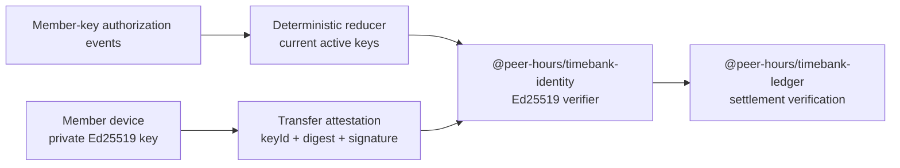

# @peer-hours/timebank-identity

`@peer-hours/timebank-identity` is the member-key authorization and Ed25519 attestation-verification library for Peer Hours. It gives the ledger a focused way to verify that a transfer was signed by the active, community-scoped key named by each participant.

It defines immutable key lifecycle events that are suitable for future replication, but does not itself persist, replicate, or authorize those events.

## Role in Peer Hours



The identity package sits between signed member activity and the accounting rules. It depends on `@peer-hours/timebank-ledger` only for the transfer and verifier types that it supports; it does not settle transfers or derive balances.

## Current responsibilities

- Validate immutable, community-scoped authorizations for Ed25519 public keys.
- Create activation and revocation events for a member signing key, with canonical UTC timestamps and stable event IDs.
- Deterministically reduce an unordered event history into current authorizations.
- Treat repeated identical lifecycle events as idempotent and reject conflicting content that reuses an event ID.
- Support multiple active keys for one member during key rotation, while keeping each key scoped to one community and member.
- Encode deterministic transfer terms, excluding the attestation envelope, so both participants sign the same bytes.
- Produce a base64url SHA-256 digest of those transfer terms.
- Provide a ledger-compatible Ed25519 verifier that checks the exact named `keyId`, active authorization, payload digest, and signature.
- Provide a generic detached-signature verifier for other versioned, immutable member payloads such as record envelopes.

## Explicit non-responsibilities

- It does not create private keys, store private keys, or expose private keys to the desktop renderer or a community node API.
- It does not yet model the decided open-participation identity policy: self-owned signing identities without community membership approval. The current authorization-event issuer model is unresolved and must not become a central admission mechanism.
- It does not persist, replicate, discover, synchronize, or fetch authorization events.
- It does not turn the current event shape into a network protocol. A formally versioned canonical JSON profile and replicated record storage are still needed.
- It does not create, validate, or settle ledger transfers; `@peer-hours/timebank-ledger` owns settlement invariants and balance derivation.
- It does not link a transfer to an accepted proposal; `@peer-hours/timebank-settlement` currently provides in-memory validation for that relationship.

## Public API and concepts

### Current authorizations

`MemberSigningKeyAuthorization` records the community, member, `keyId`, Ed25519 public key PEM, and active state for one signing key. Create one with `createMemberSigningKeyAuthorization(input)`. The verifier snapshots the supplied authorization list when it is created.

### Lifecycle events

`MemberSigningKeyAuthorizationEvent` is either an `activate` event containing a public key or a `revoke` event that targets a known community, member, and key ID. Create events with `createMemberSigningKeyAuthorizationEvent(input)`.

Use `reduceMemberSigningKeyAuthorizationEvents(events)` to derive current authorizations from an unordered event history. Ordering is determined by canonical `occurredAt` timestamp and then `eventId`; a duplicated event ID with different immutable terms is rejected.

These events are replicated-ready data shapes, not yet replicated facts. Receiving a well-formed event does not currently prove that its sender had community authority to issue it.

### Transfer signing and verification

`canonicalTransferPayload(transfer)` returns the exact bytes participants sign. `transferPayloadDigest(transfer)` returns their SHA-256 base64url digest.

Use `createEd25519SignatureVerifier(authorizations)` to produce the `SignatureVerifier` expected by `@peer-hours/timebank-ledger`. It verifies that an attestation:

- names an active key authorized for the attesting member in the transfer's community;
- carries the current digest for the canonical transfer terms; and
- contains a valid Ed25519 signature for those terms.

`createEd25519MemberSignatureVerifier(authorizations)` exposes the same active-key and community/member scoping for a caller-supplied canonical payload. It is used by `@peer-hours/timebank-records` to verify signatures over immutable record envelopes; that package currently requires an accepted proposal's envelope signature to belong to its accepting member, and allows either transfer participant to sign a transfer envelope. This generic verifier does not define those record-authorship rules, the payload format, or community-authority policy.

## Dependencies

At runtime, this package depends on:

- Node.js `crypto` for Ed25519 key parsing, SHA-256, and verification.
- `@peer-hours/timebank-ledger` for its `Transfer` and `SignatureVerifier` contract.

The dependency direction is intentional: the ledger defines the generic verification boundary, while identity supplies one concrete verifier without making the ledger crypto-aware.

## Validation

From the repository root:

```sh
npm --workspace @peer-hours/timebank-identity test
npm --workspace @peer-hours/timebank-identity run typecheck
npm --workspace @peer-hours/timebank-identity run build
```

Run the full repository checks before integrating a cross-package change:

```sh
npm test
npm run typecheck
npm run build
```
