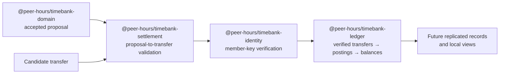

# @peer-hours/timebank-ledger

`@peer-hours/timebank-ledger` is the pure settlement and balance-derivation library for Peer Hours. It turns verified, community-scoped transfers into immutable postings and derived member balances.

It is intentionally independent of the desktop app, community nodes, storage, replication, and any particular cryptography implementation. That keeps the rules that move time credits explicit, deterministic, and testable on every participating runtime.

## Role in Peer Hours



The ledger is the accounting boundary. The domain package describes member agreements; the identity package determines whether a participant attestation is valid; the settlement package checks a transfer against an accepted proposal. This package only applies transfers that have already satisfied its structural rules and supplied verifier.

## Current responsibilities

- Create immutable, structurally valid transfers.
- Require a distinct provider and recipient, positive whole-minute amounts, and exactly one attestation from each participant.
- Require a settlement transfer to identify its source proposal; require a compensating reversal to identify the transfer it reverses.
- Delegate attestation verification to a caller-supplied `SignatureVerifier`.
- Apply transfers deterministically for one community, deduplicating identical transfer replay and rejecting same-ID conflicts.
- Prevent more than one ordinary settlement transfer for a source proposal.
- Derive equal-and-opposite postings and balances from verified transfers.
- Validate compensating reversals without editing or deleting the original transfer.

## Explicit non-responsibilities

- It does not create, accept, or look up proposals.
- It does not perform cryptography, manage keys, or decide which member keys are authorized. Use `@peer-hours/timebank-identity` to supply an Ed25519 verifier.
- It does not persist, replicate, discover, or synchronize transfers.
- It does not decide who has authority to operate a community or authorize/revoke a member key.
- It does not enforce credit limits, resolve disputes, or prevent concurrent spending across disconnected replicas.
- It does not make `sourceProposalId` a network-level proof that an accepted proposal exists. That linkage is currently checked in memory by `@peer-hours/timebank-settlement`; replicated record resolution remains future work.

## Public API and concepts

### Transfers and attestations

A `Transfer` is an immutable community-scoped settlement record. Ordinary settlements include `sourceProposalId`; reversals include `reversesTransferId`. A `TransferAttestation` names the participant, their `keyId`, a `payloadDigest`, and a signature. This package validates that both participants attest, then gives each attestation and transfer to the injected verifier.

Use `createTransfer(input)` to validate and normalize a transfer. It does not verify the signatures itself.

### Verification boundary

`SignatureVerifier` is a function that receives `{ transfer, attestation }` and returns whether that attestation verifies for that exact transfer. The ledger accepts this dependency instead of importing a cryptography library. `@peer-hours/timebank-identity` provides the current Ed25519 implementation.

### Derived ledger view

Use `applyTransfers({ communityId, transfers, verifyAttestation })` to create a `Ledger`. The result includes:

- `transfers`: verified, deduplicated transfers in stable ID order.
- `postings`: the equal-and-opposite per-member movements.
- `balances`: the balance record derived from those postings.

`derivePostings(transfer)` is also exported for the two postings associated with one structurally valid transfer.

## Dependencies

This package has no runtime package dependencies. Its only development dependencies support TypeScript compilation and tests. The absence of a crypto, storage, or network dependency is deliberate.

## Validation

From the repository root:

```sh
npm --workspace @peer-hours/timebank-ledger test
npm --workspace @peer-hours/timebank-ledger run typecheck
npm --workspace @peer-hours/timebank-ledger run build
```

Run the full repository checks before integrating a cross-package change:

```sh
npm test
npm run typecheck
npm run build
```
